# C4 Model Architecture Document — Chatbot QA Automation Platform

> **Version:** 1.0
> **Ngày tạo:** 2026-06-18
> **Tham chiếu:** [PRD v1.0](../product/PRD.md)
> **Tác giả:** Architecture Team

---

## Mục lục

1. [Tổng quan](#1-tổng-quan)
2. [Level 1: System Context Diagram](#2-level-1-system-context-diagram)
3. [Level 2: Container Diagram](#3-level-2-container-diagram)
4. [Level 3: Component Diagrams](#4-level-3-component-diagrams)
   - [3a. Frontend Components](#4a-frontend-components)
   - [3b. Backend Components](#4b-backend-components)
   - [3c. Runner Components](#4c-runner-components)
5. [Communication Patterns](#5-communication-patterns)
6. [Technology Choices Rationale](#6-technology-choices-rationale)
7. [Data Flow Diagrams](#7-data-flow-diagrams)
8. [Deployment View](#8-deployment-view)
9. [Cross-cutting Concerns](#9-cross-cutting-concerns)

---

## 1. Tổng quan

Chatbot QA Automation Platform là nền tảng nội bộ giúp đội QC tự động hóa việc kiểm thử chatbot thông qua API. Hệ thống thay thế quy trình thủ công dựa trên Excel bằng một platform tích hợp, hỗ trợ:

- **AI-assisted testcase generation** — Sinh testcase tự động từ business requirement
- **Structured evaluation** — Chấm điểm theo field/component/tool/rubric thay vì LLM all-in-one judge
- **Flexible response mapping** — Hỗ trợ nhiều chatbot response schema khác nhau
- **Async evaluation runner** — Chạy test bất đồng bộ qua Redis queue với promptfoo adapter
- **Manual review workflow** — Tách rõ auto evaluation và QC final review

Tài liệu này mô tả kiến trúc hệ thống theo C4 Model (Level 1–3), bao gồm các diagram, communication patterns, data flows, và cross-cutting concerns.

---

## 2. Level 1: System Context Diagram

### 2.1 Mô tả

System Context Diagram thể hiện Chatbot QA Automation Platform trong bối cảnh tổng thể, bao gồm các actors (người dùng) và external systems mà platform tương tác.

### 2.2 Actors

| Actor | Vai trò | Tương tác chính |
|-------|---------|-----------------|
| **QC Engineer** | Người dùng chính. Tạo project, cấu hình target, import/tạo testcase, định nghĩa assertions, chạy test, review kết quả | Sử dụng toàn bộ tính năng platform qua Frontend |
| **QC Leader / Admin** | Quản lý project, review kết quả tổng hợp, quản lý rubric library, cấu hình hệ thống | Sử dụng platform với quyền quản trị bổ sung |

### 2.3 External Systems

| External System | Vai trò | Giao thức |
|-----------------|---------|-----------|
| **Internal Chatbot API** | Hệ thống chatbot đang được test. Runner gọi API này để lấy response cần đánh giá | HTTP/REST |
| **LLM Provider** | Cung cấp AI cho LLM-as-judge (rubric evaluation) và AI testcase generation | HTTP/REST API |
| **Email/Notification Service** *(Phase 2+)* | Gửi thông báo khi run hoàn tất, có test fail, hoặc cần review | SMTP / HTTP webhook |

### 2.4 Diagram

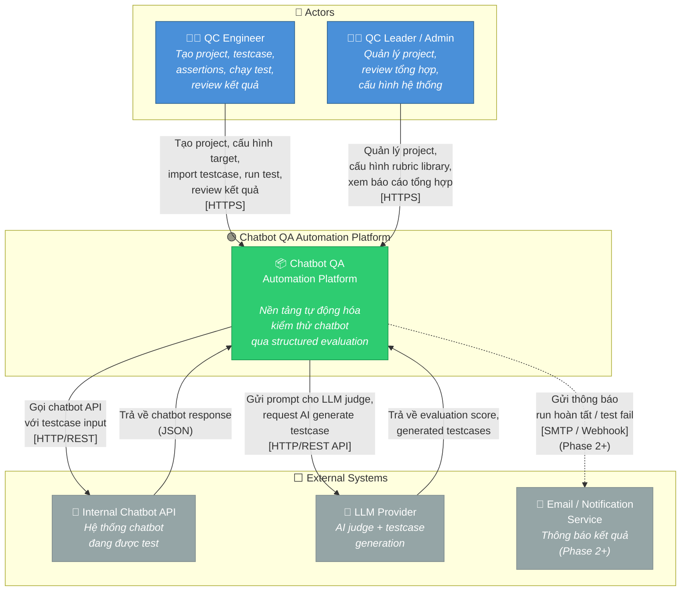
```mermaid
graph TB
    subgraph actors ["👤 Actors"]
        QCE["🧑‍💻 QC Engineer<br/><i>Tạo project, testcase,<br/>assertions, chạy test,<br/>review kết quả</i>"]
        QCL["👨‍💼 QC Leader / Admin<br/><i>Quản lý project,<br/>review tổng hợp,<br/>cấu hình hệ thống</i>"]
    end

    subgraph system ["🟢 Chatbot QA Automation Platform"]
        PLATFORM["📦 Chatbot QA<br/>Automation Platform<br/><br/><i>Nền tảng tự động hóa<br/>kiểm thử chatbot<br/>qua structured evaluation</i>"]
    end

    subgraph externals ["⬜ External Systems"]
        CHATBOT["🤖 Internal Chatbot API<br/><i>Hệ thống chatbot<br/>đang được test</i>"]
        LLM["🧠 LLM Provider<br/><i>AI judge + testcase<br/>generation</i>"]
        EMAIL["📧 Email / Notification<br/>Service<br/><i>Thông báo kết quả<br/>(Phase 2+)</i>"]
    end

    QCE -- "Tạo project, cấu hình target,<br/>import testcase, run test,<br/>review kết quả<br/>[HTTPS]" --> PLATFORM
    QCL -- "Quản lý project,<br/>cấu hình rubric library,<br/>xem báo cáo tổng hợp<br/>[HTTPS]" --> PLATFORM

    PLATFORM -- "Gọi chatbot API<br/>với testcase input<br/>[HTTP/REST]" --> CHATBOT
    PLATFORM -- "Gửi prompt cho LLM judge,<br/>request AI generate testcase<br/>[HTTP/REST API]" --> LLM
    PLATFORM -. "Gửi thông báo<br/>run hoàn tất / test fail<br/>[SMTP / Webhook]<br/>(Phase 2+)" .-> EMAIL

    CHATBOT -- "Trả về chatbot response<br/>(JSON)" --> PLATFORM
    LLM -- "Trả về evaluation score,<br/>generated testcases" --> PLATFORM

    style QCE fill:#4A90D9,stroke:#2C5F8A,color:#FFFFFF
    style QCL fill:#4A90D9,stroke:#2C5F8A,color:#FFFFFF
    style PLATFORM fill:#2ECC71,stroke:#1A9850,color:#FFFFFF
    style CHATBOT fill:#95A5A6,stroke:#7F8C8D,color:#FFFFFF
    style LLM fill:#95A5A6,stroke:#7F8C8D,color:#FFFFFF
    style EMAIL fill:#95A5A6,stroke:#7F8C8D,color:#FFFFFF
```

### 2.5 Mô tả quan hệ

| Từ | Đến | Mô tả | Hướng dữ liệu |
|----|-----|--------|---------------|
| QC Engineer | Platform | Thao tác CRUD project, target, dataset, testcase, assertions, rubric. Trigger run, xem report, manual review | Request → Platform |
| QC Leader / Admin | Platform | Quản lý project, cấu hình global rubric, xem dashboard, quản lý user | Request → Platform |
| Platform | Internal Chatbot API | Runner gọi chatbot API với testcase input đã inject, nhận response JSON | Request ↔ Response |
| Platform | LLM Provider | Backend/Runner gửi prompt cho AI generate testcase, AI suggest assertions, LLM judge evaluation | Request ↔ Response |
| Platform | Email Service | *(Future)* Gửi notification khi run hoàn tất hoặc có kết quả cần review | Platform → Email |

---

## 3. Level 2: Container Diagram

### 3.1 Mô tả

Container Diagram thể hiện các deployable units (containers) chính của hệ thống, cách chúng giao tiếp với nhau và với external systems.

### 3.2 Containers

| Container | Công nghệ | Vai trò |
|-----------|-----------|---------|
| **Frontend SPA** | React + Vite + TypeScript | Giao diện người dùng cho QC thao tác toàn bộ tính năng |
| **Backend API** | Java Spring Boot | API server chính, quản lý domain model, business logic, orchestration |
| **Evaluation Runner** | Node.js service | Nhận job từ queue, gọi chatbot API, chạy assertions, gửi kết quả |
| **PostgreSQL Database** | PostgreSQL | Lưu trữ dữ liệu chính: projects, datasets, testcases, runs, results |
| **Redis** | Redis | Job queue cho async evaluation, pub/sub cho progress updates |
| **Local Artifact Storage** | File System | Lưu trữ test results, config snapshots, promptfoo output, reports |

### 3.3 Diagram

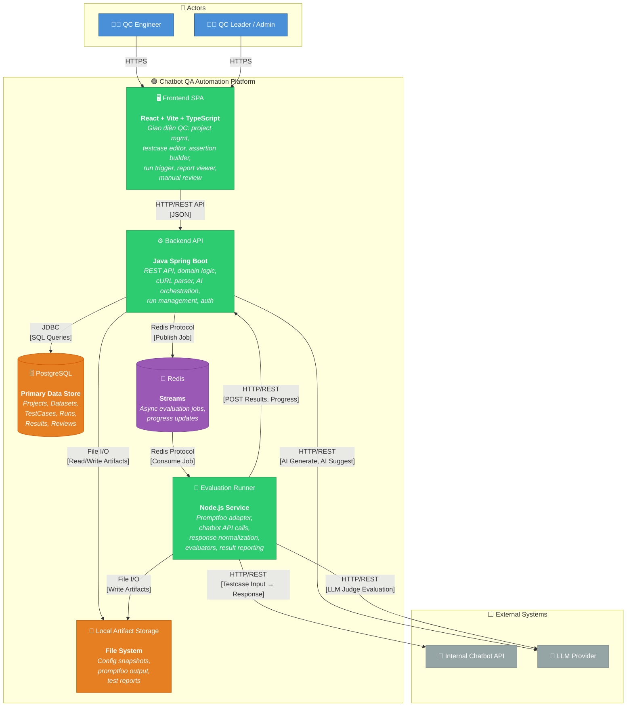
```mermaid
graph TB
    subgraph actors ["👤 Actors"]
        QCE["🧑‍💻 QC Engineer"]
        QCL["👨‍💼 QC Leader / Admin"]
    end

    subgraph platform ["🟢 Chatbot QA Automation Platform"]
        FE["🖥️ Frontend SPA<br/><br/><b>React + Vite + TypeScript</b><br/><i>Giao diện QC: project mgmt,<br/>testcase editor, assertion builder,<br/>run trigger, report viewer,<br/>manual review</i>"]

        BE["⚙️ Backend API<br/><br/><b>Java Spring Boot</b><br/><i>REST API, domain logic,<br/>cURL parser, AI orchestration,<br/>run management, auth</i>"]

        RUNNER["🏃 Evaluation Runner<br/><br/><b>Node.js Service</b><br/><i>Promptfoo adapter,<br/>chatbot API calls,<br/>response normalization,<br/>evaluators, result reporting</i>"]

        DB[("🗄️ PostgreSQL<br/><br/><b>Primary Data Store</b><br/><i>Projects, Datasets,<br/>TestCases, Runs,<br/>Results, Reviews</i>")]

        REDIS[("📮 Redis<br/><br/><b>Streams</b><br/><i>Async evaluation jobs,<br/>progress updates</i>")]

        STORAGE["📁 Local Artifact Storage<br/><br/><b>File System</b><br/><i>Config snapshots,<br/>promptfoo output,<br/>test reports</i>"]
    end

    subgraph externals ["⬜ External Systems"]
        CHATBOT["🤖 Internal Chatbot API"]
        LLM["🧠 LLM Provider"]
    end

    QCE -- "HTTPS" --> FE
    QCL -- "HTTPS" --> FE

    FE -- "HTTP/REST API<br/>[JSON]" --> BE

    BE -- "JDBC<br/>[SQL Queries]" --> DB
    BE -- "Redis Protocol<br/>[Publish Job]" --> REDIS
    BE -- "File I/O<br/>[Read/Write Artifacts]" --> STORAGE
    BE -- "HTTP/REST<br/>[AI Generate, AI Suggest]" --> LLM

    REDIS -- "Redis Protocol<br/>[Consume Job]" --> RUNNER

    RUNNER -- "HTTP/REST<br/>[Testcase Input → Response]" --> CHATBOT
    RUNNER -- "HTTP/REST<br/>[LLM Judge Evaluation]" --> LLM
    RUNNER -- "HTTP/REST<br/>[POST Results, Progress]" --> BE
    RUNNER -- "File I/O<br/>[Write Artifacts]" --> STORAGE

    style QCE fill:#4A90D9,stroke:#2C5F8A,color:#FFFFFF
    style QCL fill:#4A90D9,stroke:#2C5F8A,color:#FFFFFF
    style FE fill:#2ECC71,stroke:#1A9850,color:#FFFFFF
    style BE fill:#2ECC71,stroke:#1A9850,color:#FFFFFF
    style RUNNER fill:#2ECC71,stroke:#1A9850,color:#FFFFFF
    style DB fill:#E67E22,stroke:#D35400,color:#FFFFFF
    style REDIS fill:#9B59B6,stroke:#7D3C98,color:#FFFFFF
    style STORAGE fill:#E67E22,stroke:#D35400,color:#FFFFFF
    style CHATBOT fill:#95A5A6,stroke:#7F8C8D,color:#FFFFFF
    style LLM fill:#95A5A6,stroke:#7F8C8D,color:#FFFFFF
```

### 3.4 Mô tả giao tiếp giữa containers

| Từ | Đến | Giao thức | Mô tả |
|----|-----|-----------|--------|
| Frontend SPA | Backend API | HTTP/REST (JSON) | Tất cả thao tác CRUD, trigger run, fetch report, manual review |
| Backend API | PostgreSQL | JDBC / JPA | Đọc/ghi toàn bộ domain data |
| Backend API | Redis | Redis Protocol (XADD) | Publish evaluation job khi user trigger run |
| Backend API | LLM Provider | HTTP/REST | AI generate testcase, AI suggest assertions |
| Backend API | Local Artifact Storage | File I/O | Đọc/ghi config snapshots, reports |
| Redis | Evaluation Runner | Redis Protocol (XREADGROUP) | Runner consume job từ Stream |
| Evaluation Runner | Internal Chatbot API | HTTP/REST | Gọi chatbot API với testcase input |
| Evaluation Runner | LLM Provider | HTTP/REST | LLM judge evaluation (qua promptfoo) |
| Evaluation Runner | Backend API | HTTP/REST | POST results + progress updates (internal API) |
| Evaluation Runner | Local Artifact Storage | File I/O | Ghi promptfoo output, detailed results |

---

## 4. Level 3: Component Diagrams

### 4a. Frontend Components

#### Mô tả

Frontend SPA được xây dựng bằng React + Vite + TypeScript, cung cấp giao diện cho QC thao tác toàn bộ lifecycle: từ tạo project, cấu hình target, import/tạo testcase, đến chạy test và review kết quả.

#### Diagram

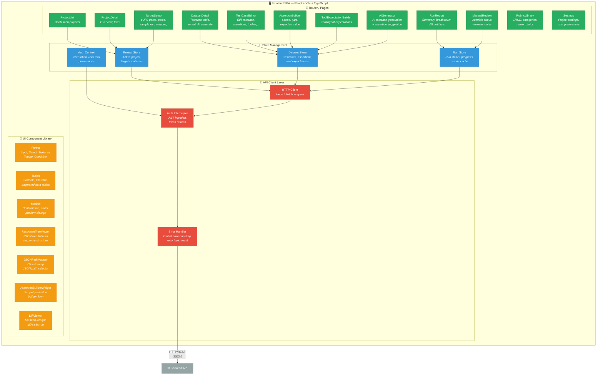
```mermaid
graph TB
    subgraph frontend ["🖥️ Frontend SPA — React + Vite + TypeScript"]

        subgraph router ["📍 Router / Pages"]
            PL["ProjectList<br/><i>Danh sách projects</i>"]
            PD["ProjectDetail<br/><i>Overview, tabs</i>"]
            TS["TargetSetup<br/><i>cURL paste, parse,<br/>sample run, mapping</i>"]
            DSD["DatasetDetail<br/><i>Testcase table,<br/>import, AI generate</i>"]
            TCE["TestCaseEditor<br/><i>Edit testcase,<br/>assertions, tool exp.</i>"]
            AB["AssertionBuilder<br/><i>Scope, type,<br/>expected value</i>"]
            TEB["ToolExpectationBuilder<br/><i>Tool/agent expectations</i>"]
            AIG["AIGenerator<br/><i>AI testcase generation<br/>+ assertion suggestion</i>"]
            RR["RunReport<br/><i>Summary, breakdown,<br/>diff, artifacts</i>"]
            MR["ManualReview<br/><i>Override status,<br/>reviewer notes</i>"]
            RL["RubricLibrary<br/><i>CRUD, categories,<br/>reuse rubrics</i>"]
            SET["Settings<br/><i>Project settings,<br/>user preferences</i>"]
        end

        subgraph state ["🧠 State Management"]
            AUTH_S["Auth Context<br/><i>JWT token, user info,<br/>permissions</i>"]
            PROJ_S["Project Store<br/><i>Active project,<br/>targets, datasets</i>"]
            DS_S["Dataset Store<br/><i>Testcases, assertions,<br/>tool expectations</i>"]
            RUN_S["Run Store<br/><i>Run status, progress,<br/>results cache</i>"]
        end

        subgraph api_client ["🔌 API Client Layer"]
            HTTP["HTTP Client<br/><i>Axios / Fetch wrapper</i>"]
            AUTH_I["Auth Interceptor<br/><i>JWT injection,<br/>token refresh</i>"]
            ERR_H["Error Handler<br/><i>Global error handling,<br/>retry logic, toast</i>"]
        end

        subgraph ui_lib ["🎨 UI Component Library"]
            FORMS["Forms<br/><i>Input, Select, Textarea,<br/>Toggle, Checkbox</i>"]
            TABLES["Tables<br/><i>Sortable, filterable,<br/>paginated data tables</i>"]
            MODALS["Modals<br/><i>Confirmation, editor,<br/>preview dialogs</i>"]
            RTV["ResponseTreeViewer<br/><i>JSON tree hiển thị<br/>response structure</i>"]
            JPM["JSONPathMapper<br/><i>Click-to-map<br/>JSON path selector</i>"]
            ABW["AssertionBuilderWidget<br/><i>Scope/type/value<br/>builder form</i>"]
            DV["DiffViewer<br/><i>So sánh kết quả<br/>giữa các run</i>"]
        end
    end

    PL --> PROJ_S
    PD --> PROJ_S
    TS --> PROJ_S
    DSD --> DS_S
    TCE --> DS_S
    AB --> DS_S
    TEB --> DS_S
    AIG --> DS_S
    RR --> RUN_S
    MR --> RUN_S

    PROJ_S --> HTTP
    DS_S --> HTTP
    RUN_S --> HTTP
    AUTH_S --> AUTH_I

    HTTP --> AUTH_I
    AUTH_I --> ERR_H

    BE_EXT["⚙️ Backend API"]
    ERR_H -- "HTTP/REST<br/>[JSON]" --> BE_EXT

    style PL fill:#27AE60,stroke:#1E8449,color:#FFF
    style PD fill:#27AE60,stroke:#1E8449,color:#FFF
    style TS fill:#27AE60,stroke:#1E8449,color:#FFF
    style DSD fill:#27AE60,stroke:#1E8449,color:#FFF
    style TCE fill:#27AE60,stroke:#1E8449,color:#FFF
    style AB fill:#27AE60,stroke:#1E8449,color:#FFF
    style TEB fill:#27AE60,stroke:#1E8449,color:#FFF
    style AIG fill:#27AE60,stroke:#1E8449,color:#FFF
    style RR fill:#27AE60,stroke:#1E8449,color:#FFF
    style MR fill:#27AE60,stroke:#1E8449,color:#FFF
    style RL fill:#27AE60,stroke:#1E8449,color:#FFF
    style SET fill:#27AE60,stroke:#1E8449,color:#FFF
    style AUTH_S fill:#3498DB,stroke:#2980B9,color:#FFF
    style PROJ_S fill:#3498DB,stroke:#2980B9,color:#FFF
    style DS_S fill:#3498DB,stroke:#2980B9,color:#FFF
    style RUN_S fill:#3498DB,stroke:#2980B9,color:#FFF
    style HTTP fill:#E74C3C,stroke:#C0392B,color:#FFF
    style AUTH_I fill:#E74C3C,stroke:#C0392B,color:#FFF
    style ERR_H fill:#E74C3C,stroke:#C0392B,color:#FFF
    style FORMS fill:#F39C12,stroke:#E67E22,color:#FFF
    style TABLES fill:#F39C12,stroke:#E67E22,color:#FFF
    style MODALS fill:#F39C12,stroke:#E67E22,color:#FFF
    style RTV fill:#F39C12,stroke:#E67E22,color:#FFF
    style JPM fill:#F39C12,stroke:#E67E22,color:#FFF
    style ABW fill:#F39C12,stroke:#E67E22,color:#FFF
    style DV fill:#F39C12,stroke:#E67E22,color:#FFF
    style BE_EXT fill:#95A5A6,stroke:#7F8C8D,color:#FFF
```

#### Mô tả thành phần

| Layer | Component | Trách nhiệm |
|-------|-----------|-------------|
| **Router/Pages** | `ProjectList` | Hiển thị danh sách projects, tạo mới, archive |
| | `ProjectDetail` | Tabs: Overview, Targets, Datasets, Rubrics, Runs, Settings |
| | `TargetSetup` | Paste cURL → parse → secret review → input binding → sample run → response mapping → tool trace mapping |
| | `DatasetDetail` | Testcase table với filter/group by section, import CSV/Excel, AI generate, run dataset |
| | `TestCaseEditor` | Edit testcase fields, quản lý assertions và tool expectations |
| | `AssertionBuilder` | Chọn scope (field/component/multi-field/whole-response), type, expected value, severity |
| | `ToolExpectationBuilder` | Tạo tool/agent expectations: must call, args match, sequence, count |
| | `AIGenerator` | Input context → AI generate testcase drafts → QC review → add to dataset |
| | `RunReport` | Run summary, assertion breakdown, tool expectation breakdown, raw/normalized response, manual review |
| | `ManualReview` | Override auto status, thêm reviewer note, chốt final status |
| | `RubricLibrary` | CRUD rubrics, filter by category/scope, preview, reuse across testcases |
| | `Settings` | Project settings, user preferences, global configuration |
| **State Management** | `Auth Context` | Lưu JWT token, user info, handle login/logout, permission check |
| | `Project Store` | Active project data, targets list, datasets list |
| | `Dataset Store` | Testcases, assertions, tool expectations cho dataset đang active |
| | `Run Store` | Run status, progress polling, results cache, report data |
| **API Client** | `HTTP Client` | Axios/Fetch wrapper với base URL, request/response interceptors |
| | `Auth Interceptor` | Inject JWT vào header, handle 401 → redirect login |
| | `Error Handler` | Global error handling, retry logic, toast notifications |
| **UI Components** | `Forms` | Input, Select, Textarea, Toggle, Checkbox — reusable form components |
| | `Tables` | Sortable, filterable, paginated data tables cho testcases, results |
| | `Modals` | Confirmation dialogs, editor modals, preview panels |
| | `ResponseTreeViewer` | Hiển thị JSON response dạng tree, highlight mapped components |
| | `JSONPathMapper` | Click-to-map — click node trong tree → auto fill JSON path |
| | `AssertionBuilderWidget` | Builder form cho assertion: scope selector, type dropdown, value input |
| | `DiffViewer` | So sánh kết quả giữa 2 runs, highlight changes |

---

### 4b. Backend Components

#### Mô tả

Backend API là Java Spring Boot application, đóng vai trò trung tâm: quản lý toàn bộ domain model, business logic, orchestrate AI calls, quản lý run lifecycle, và expose REST API cho Frontend + internal API cho Runner.

#### Diagram


```mermaid
graph TB
    subgraph backend ["⚙️ Backend API — Java Spring Boot"]

        subgraph controllers ["🎯 API Layer — Controllers"]
            PC["ProjectController<br/><i>CRUD projects</i>"]
            TC_C["TargetController<br/><i>cURL import,<br/>target mgmt</i>"]
            DSC["DatasetController<br/><i>CRUD datasets</i>"]
            TCC["TestCaseController<br/><i>CRUD testcases,<br/>import</i>"]
            AC["AssertionController<br/><i>CRUD assertions</i>"]
            TECC["ToolExpectationController<br/><i>CRUD tool expectations</i>"]
            RBC["RubricController<br/><i>CRUD rubrics,<br/>global/project scope</i>"]
            RC["RunController<br/><i>Trigger, cancel,<br/>results, rerun</i>"]
            AIC["AIController<br/><i>AI generate,<br/>AI suggest</i>"]
            AUTHC["AuthController<br/><i>Login, register,<br/>token refresh</i>"]
            IC["InternalController<br/><i>Runner results,<br/>progress updates</i>"]
        end

        subgraph services ["🔧 Service Layer"]
            PS["ProjectService"]
            TS_S["TargetService<br/><i>incl. cURL Parser</i>"]
            DSS["DatasetService"]
            TCS["TestCaseService"]
            AS["AssertionService"]
            IMS["ImportService<br/><i>CSV/Excel parsing,<br/>column mapping</i>"]
            AIGS["AIGeneratorService<br/><i>Prompt construction,<br/>LLM API call,<br/>draft management</i>"]
            RS["RunService<br/><i>Run lifecycle,<br/>snapshot creation,<br/>job publishing</i>"]
            RVS["ReviewService<br/><i>Manual review,<br/>status override</i>"]
            RBS["RubricService<br/><i>Scope resolution,<br/>merge rules</i>"]
        end

        subgraph domain ["📐 Domain Model"]
            DM["Project | Target | RequestTemplate<br/>ResponseMapping | Dataset | TestCase<br/>Assertion | ToolExpectation | Rubric<br/>Run | TestResult | AssertionResult<br/>ToolExpectationResult | ManualReview"]
        end

        subgraph infra ["🏗️ Infrastructure"]
            REPO["JPA Repositories<br/><i>Spring Data JPA,<br/>custom queries</i>"]
            RSP["Redis Stream Publisher<br/><i>Job serialization,<br/>XADD to stream</i>"]
            ASC["Artifact Storage Client<br/><i>Read/Write files,<br/>path management</i>"]
            JWT_RS["JWT Resource Server<br/><i>JwtDecoder,<br/>SecurityContext</i>"]
            SM["Secret Manager<br/><i>Encryption, masking,<br/>reference resolution</i>"]
        end

        subgraph adapters ["🔄 Adapters"]
            PCA["PromptfooConfigGenerator<br/><i>Domain → promptfoo YAML<br/>Target → provider<br/>TestCase → test<br/>Assertion → assert<br/>Rubric → llm-rubric</i>"]
        end
    end

    FE_EXT["🖥️ Frontend SPA"]
    RUNNER_EXT["🏃 Evaluation Runner"]

    FE_EXT -- "HTTP/REST" --> controllers
    RUNNER_EXT -- "HTTP/REST<br/>[Internal API]" --> IC

    controllers --> services
    services --> domain
    services --> infra
    services --> adapters

    DB_EXT[("🗄️ PostgreSQL")]
    REDIS_EXT[("📮 Redis")]
    STORE_EXT["📁 Artifact Storage"]
    LLM_EXT["🧠 LLM Provider"]

    REPO -- "JDBC" --> DB_EXT
    RSP -- "Redis Protocol" --> REDIS_EXT
    ASC -- "File I/O" --> STORE_EXT
    AIGS -- "HTTP/REST" --> LLM_EXT

    style PC fill:#27AE60,stroke:#1E8449,color:#FFF
    style TC_C fill:#27AE60,stroke:#1E8449,color:#FFF
    style DSC fill:#27AE60,stroke:#1E8449,color:#FFF
    style TCC fill:#27AE60,stroke:#1E8449,color:#FFF
    style AC fill:#27AE60,stroke:#1E8449,color:#FFF
    style TECC fill:#27AE60,stroke:#1E8449,color:#FFF
    style RBC fill:#27AE60,stroke:#1E8449,color:#FFF
    style RC fill:#27AE60,stroke:#1E8449,color:#FFF
    style AIC fill:#27AE60,stroke:#1E8449,color:#FFF
    style AUTHC fill:#27AE60,stroke:#1E8449,color:#FFF
    style IC fill:#27AE60,stroke:#1E8449,color:#FFF
    style PS fill:#3498DB,stroke:#2980B9,color:#FFF
    style TS_S fill:#3498DB,stroke:#2980B9,color:#FFF
    style DSS fill:#3498DB,stroke:#2980B9,color:#FFF
    style TCS fill:#3498DB,stroke:#2980B9,color:#FFF
    style AS fill:#3498DB,stroke:#2980B9,color:#FFF
    style IMS fill:#3498DB,stroke:#2980B9,color:#FFF
    style AIGS fill:#3498DB,stroke:#2980B9,color:#FFF
    style RS fill:#3498DB,stroke:#2980B9,color:#FFF
    style RVS fill:#3498DB,stroke:#2980B9,color:#FFF
    style RBS fill:#3498DB,stroke:#2980B9,color:#FFF
    style DM fill:#1ABC9C,stroke:#16A085,color:#FFF
    style REPO fill:#E67E22,stroke:#D35400,color:#FFF
    style RSP fill:#9B59B6,stroke:#7D3C98,color:#FFF
    style ASC fill:#E67E22,stroke:#D35400,color:#FFF
    style JWT_RS fill:#E74C3C,stroke:#C0392B,color:#FFF
    style SM fill:#E74C3C,stroke:#C0392B,color:#FFF
    style PCA fill:#F39C12,stroke:#E67E22,color:#FFF
    style DB_EXT fill:#E67E22,stroke:#D35400,color:#FFF
    style REDIS_EXT fill:#9B59B6,stroke:#7D3C98,color:#FFF
    style STORE_EXT fill:#E67E22,stroke:#D35400,color:#FFF
    style LLM_EXT fill:#95A5A6,stroke:#7F8C8D,color:#FFF
    style FE_EXT fill:#95A5A6,stroke:#7F8C8D,color:#FFF
    style RUNNER_EXT fill:#95A5A6,stroke:#7F8C8D,color:#FFF
```

#### Mô tả thành phần

| Layer | Component | Trách nhiệm |
|-------|-----------|-------------|
| **Controllers** | `ProjectController` | CRUD projects, archive, list với pagination |
| | `TargetController` | Import cURL, CRUD targets, sample run, input/variable binding, response mapping, tool trace mapping |
| | `DatasetController` | CRUD datasets trong project |
| | `TestCaseController` | CRUD testcases, import CSV/Excel, AI suggest assertions |
| | `AssertionController` | CRUD assertions cho testcase |
| | `ToolExpectationController` | CRUD tool expectations cho testcase |
| | `RubricController` | CRUD rubrics (global/project/dataset scope), AI generate rubric |
| | `RunController` | Trigger run, cancel, get results, rerun failed, manual review |
| | `AIController` | AI generate testcases, AI suggest assertions from expectedBehavior |
| | `AuthController` | Login, register, token refresh, user profile |
| | `InternalController` | **Internal API cho Runner:** nhận results, progress updates. Authenticated bằng service-to-service token |
| **Services** | `ProjectService` | Business logic cho project lifecycle |
| | `TargetService` | Parse cURL → RequestTemplate, validate URL, manage secrets, input/variable bindings |
| | `DatasetService` | Dataset CRUD, default assertions/rubrics management |
| | `TestCaseService` | TestCase lifecycle, section management, duplicate detection |
| | `AssertionService` | Assertion lifecycle, validation theo scope/type |
| | `ImportService` | Parse CSV/Excel, preview columns, column mapping, bulk create testcases |
| | `AIGeneratorService` | Construct prompt từ context, gọi LLM API, parse response → draft testcases, manage draft lifecycle |
| | `RunService` | Create Run, snapshot config (target + testcases + assertions + rubrics), publish job to Redis Streams, update status, store results |
| | `ReviewService` | Manual review workflow: set reviewed status, reviewer note, calculate final status |
| | `RubricService` | Rubric scope resolution (global → project → dataset → testcase override), merge rules |
| **Domain Model** | Core entities | `Project`, `Target`, `RequestTemplate`, `ResponseMapping`, `Dataset`, `TestCase`, `Assertion`, `ToolExpectation`, `Rubric`, `Run`, `TestResult`, `AssertionResult`, `ToolExpectationResult`, `ManualReview` |
| **Infrastructure** | `JPA Repositories` | Spring Data JPA repositories cho tất cả entities, custom queries cho reporting |
| | `Redis Stream Publisher` | Serialize job message (JSON), XADD vào Redis Stream |
| | `Artifact Storage Client` | Abstract file I/O: read/write config snapshots, reports, promptfoo output |
| | `JWT Resource Server` | Validate access JWTs with `JwtDecoder`, set `SecurityContext`, reject wrong token type or expired tokens |
| | `Secret Manager` | Encrypt/decrypt secrets, mask trong UI/logs, resolve secret references |
| **Adapters** | `PromptfooConfigGenerator` | Convert domain objects → promptfoo YAML config. **Đây là one-way adapter**: domain là source of truth, promptfoo config là generated artifact |

---

### 4c. Runner Components

#### Mô tả

Evaluation Runner là Node.js service chạy tách biệt, nhận job từ Redis queue, thực thi evaluation, và gửi kết quả về Backend. Runner sử dụng promptfoo làm evaluation engine nhưng có thể bypass promptfoo cho custom evaluators.

#### Diagram

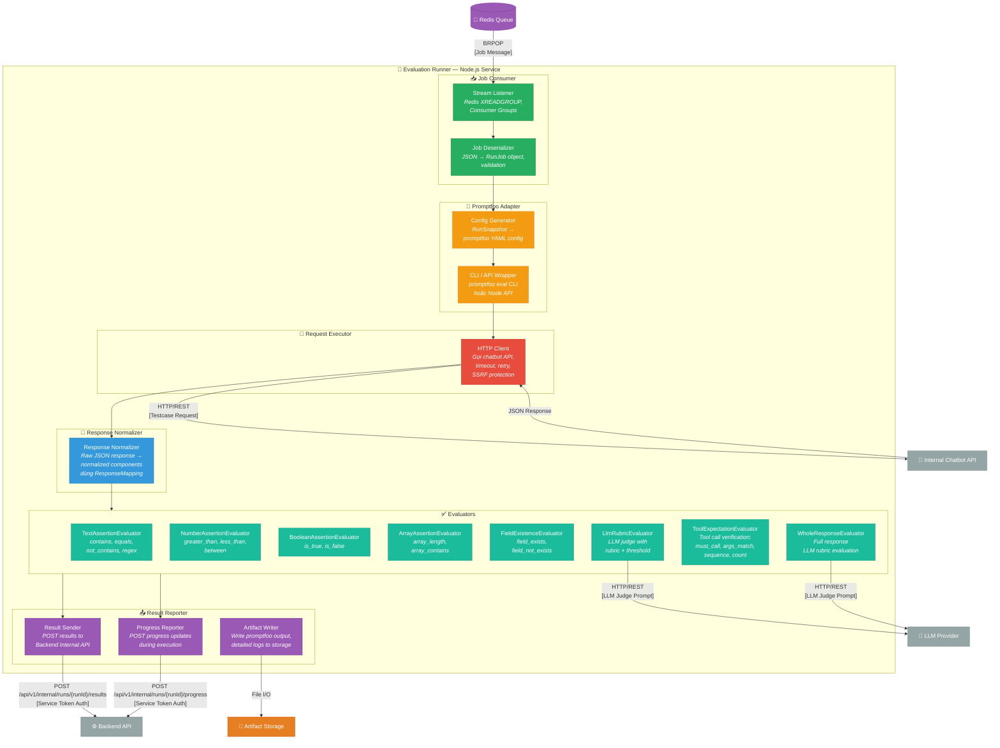
```mermaid
graph TB
    subgraph runner ["🏃 Evaluation Runner — Node.js Service"]

        subgraph job ["📥 Job Consumer"]
            QL["Stream Listener<br/><i>Redis XREADGROUP,<br/>Consumer Groups</i>"]
            JD["Job Deserializer<br/><i>JSON → RunJob object,<br/>validation</i>"]
        end

        subgraph promptfoo_adapter ["🔄 Promptfoo Adapter"]
            CG["Config Generator<br/><i>RunSnapshot →<br/>promptfoo YAML config</i>"]
            CW["CLI / API Wrapper<br/><i>promptfoo eval CLI<br/>hoặc Node API</i>"]
        end

        subgraph executor ["📡 Request Executor"]
            HC["HTTP Client<br/><i>Gọi chatbot API,<br/>timeout, retry,<br/>SSRF protection</i>"]
        end

        subgraph normalizer ["🔀 Response Normalizer"]
            RN["Response Normalizer<br/><i>Raw JSON response →<br/>normalized components<br/>dùng ResponseMapping</i>"]
        end

        subgraph evaluators ["✅ Evaluators"]
            TAE["TextAssertionEvaluator<br/><i>contains, equals,<br/>not_contains, regex</i>"]
            NAE["NumberAssertionEvaluator<br/><i>greater_than, less_than,<br/>between</i>"]
            BAE["BooleanAssertionEvaluator<br/><i>is_true, is_false</i>"]
            AAE["ArrayAssertionEvaluator<br/><i>array_length,<br/>array_contains</i>"]
            FEE["FieldExistenceEvaluator<br/><i>field_exists,<br/>field_not_exists</i>"]
            LRE["LlmRubricEvaluator<br/><i>LLM judge with<br/>rubric + threshold</i>"]
            TOEE["ToolExpectationEvaluator<br/><i>Tool call verification:<br/>must_call, args_match,<br/>sequence, count</i>"]
            WRE["WholeResponseEvaluator<br/><i>Full response<br/>LLM rubric evaluation</i>"]
        end

        subgraph reporter ["📤 Result Reporter"]
            RR_C["Result Sender<br/><i>POST results to<br/>Backend Internal API</i>"]
            PR["Progress Reporter<br/><i>POST progress updates<br/>during execution</i>"]
            AW["Artifact Writer<br/><i>Write promptfoo output,<br/>detailed logs to storage</i>"]
        end
    end

    REDIS_EXT[("📮 Redis Queue")]
    BE_EXT["⚙️ Backend API"]
    CHATBOT_EXT["🤖 Internal Chatbot API"]
    LLM_EXT["🧠 LLM Provider"]
    STORE_EXT["📁 Artifact Storage"]

    REDIS_EXT -- "BRPOP<br/>[Job Message]" --> QL
    QL --> JD
    JD --> CG

    CG --> CW
    CW --> HC
    HC -- "HTTP/REST<br/>[Testcase Request]" --> CHATBOT_EXT
    CHATBOT_EXT -- "JSON Response" --> HC

    HC --> RN
    RN --> evaluators

    LRE -- "HTTP/REST<br/>[LLM Judge Prompt]" --> LLM_EXT
    WRE -- "HTTP/REST<br/>[LLM Judge Prompt]" --> LLM_EXT

    evaluators --> RR_C
    evaluators --> PR

    RR_C -- "POST /api/v1/internal/runs/{runId}/results<br/>[Service Token Auth]" --> BE_EXT
    PR -- "POST /api/v1/internal/runs/{runId}/progress<br/>[Service Token Auth]" --> BE_EXT
    AW -- "File I/O" --> STORE_EXT

    style QL fill:#27AE60,stroke:#1E8449,color:#FFF
    style JD fill:#27AE60,stroke:#1E8449,color:#FFF
    style CG fill:#F39C12,stroke:#E67E22,color:#FFF
    style CW fill:#F39C12,stroke:#E67E22,color:#FFF
    style HC fill:#E74C3C,stroke:#C0392B,color:#FFF
    style RN fill:#3498DB,stroke:#2980B9,color:#FFF
    style TAE fill:#1ABC9C,stroke:#16A085,color:#FFF
    style NAE fill:#1ABC9C,stroke:#16A085,color:#FFF
    style BAE fill:#1ABC9C,stroke:#16A085,color:#FFF
    style AAE fill:#1ABC9C,stroke:#16A085,color:#FFF
    style FEE fill:#1ABC9C,stroke:#16A085,color:#FFF
    style LRE fill:#1ABC9C,stroke:#16A085,color:#FFF
    style TOEE fill:#1ABC9C,stroke:#16A085,color:#FFF
    style WRE fill:#1ABC9C,stroke:#16A085,color:#FFF
    style RR_C fill:#9B59B6,stroke:#7D3C98,color:#FFF
    style PR fill:#9B59B6,stroke:#7D3C98,color:#FFF
    style AW fill:#9B59B6,stroke:#7D3C98,color:#FFF
    style REDIS_EXT fill:#9B59B6,stroke:#7D3C98,color:#FFF
    style BE_EXT fill:#95A5A6,stroke:#7F8C8D,color:#FFF
    style CHATBOT_EXT fill:#95A5A6,stroke:#7F8C8D,color:#FFF
    style LLM_EXT fill:#95A5A6,stroke:#7F8C8D,color:#FFF
    style STORE_EXT fill:#E67E22,stroke:#D35400,color:#FFF
```

#### Mô tả thành phần

| Layer | Component | Trách nhiệm |
|-------|-----------|-------------|
| **Job Consumer** | `Stream Listener` | Tham gia Consumer Group, dùng XREADGROUP nhận job message khi có run mới. Gửi XACK khi hoàn thành. |
| | `Job Deserializer` | Parse JSON message → `RunJob` object, validate required fields |
| **Promptfoo Adapter** | `Config Generator` | Convert `RunSnapshot` (target, testcases, assertions, rubrics) → promptfoo YAML config file |
| | `CLI/API Wrapper` | Gọi `promptfoo eval` CLI hoặc sử dụng promptfoo Node API. Quản lý execution lifecycle |
| **Request Executor** | `HTTP Client` | Gọi Internal Chatbot API với testcase input đã inject. Xử lý timeout, retry, SSRF protection (domain allowlist) |
| **Response Normalizer** | `Response Normalizer` | Dùng `ResponseMapping` từ run snapshot để extract components từ raw JSON response. Raw response → `{ answer, intent, suggestions, toolCalls, ... }` |
| **Evaluators** | `TextAssertionEvaluator` | Đánh giá text assertions: `contains`, `not_contains`, `equals`, `not_equals`, `regex` |
| | `NumberAssertionEvaluator` | Đánh giá number assertions: `greater_than`, `less_than`, `between` |
| | `BooleanAssertionEvaluator` | Đánh giá boolean assertions: `is_true`, `is_false` |
| | `ArrayAssertionEvaluator` | Đánh giá array assertions: `array_length_greater_than`, `array_contains` |
| | `FieldExistenceEvaluator` | Kiểm tra sự tồn tại của field: `field_exists`, `field_not_exists` |
| | `LlmRubricEvaluator` | Gửi prompt + rubric + context cho LLM Provider, parse score + reasoning. Hỗ trợ rubric merge (base + override + expectedBehavior) |
| | `ToolExpectationEvaluator` | Verify tool calls: `TOOL_MUST_BE_CALLED`, `TOOL_ARGS_MATCH`, `TOOL_SEQUENCE_MATCH`, `TOOL_CALL_COUNT`, `AGENT_EQUALS`, etc. Xử lý tool trace levels (0–3) |
| | `WholeResponseEvaluator` | LLM rubric evaluation trên toàn bộ response (không target specific field/component) |
| **Result Reporter** | `Result Sender` | POST kết quả đầy đủ (`TestResult[]` + `AssertionResult[]` + `ToolExpectationResult[]`) về Backend Internal API |
| | `Progress Reporter` | POST progress updates trong quá trình chạy (completed/total testcases, current status) |
| | `Artifact Writer` | Ghi promptfoo output files, detailed evaluation logs, config snapshot vào Local Artifact Storage |

---

## 5. Communication Patterns

### 5.1 Backend ↔ Runner: Evaluation Job Flow

Đây là communication pattern chính giữa Backend và Runner, sử dụng Redis Streams cho async job processing và HTTP REST cho result reporting.

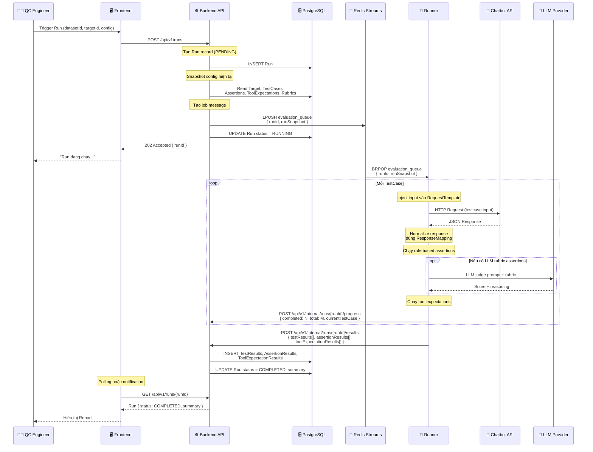
```mermaid
sequenceDiagram
    participant QC as 🧑‍💻 QC Engineer
    participant FE as 🖥️ Frontend
    participant BE as ⚙️ Backend API
    participant DB as 🗄️ PostgreSQL
    participant RD as 📮 Redis Streams
    participant RN as 🏃 Runner
    participant CB as 🤖 Chatbot API
    participant LLM as 🧠 LLM Provider

    QC->>FE: Trigger Run (datasetId, targetId, config)
    FE->>BE: POST /api/v1/runs
    
    Note over BE: Tạo Run record (PENDING)
    BE->>DB: INSERT Run
    
    Note over BE: Snapshot config hiện tại
    BE->>DB: Read Target, TestCases,<br/>Assertions, ToolExpectations, Rubrics
    
    Note over BE: Tạo job message
    BE->>RD: LPUSH evaluation_queue<br/>{ runId, runSnapshot }
    
    BE->>DB: UPDATE Run status = RUNNING
    BE-->>FE: 202 Accepted { runId }
    FE-->>QC: "Run đang chạy..."

    RD->>RN: BRPOP evaluation_queue<br/>{ runId, runSnapshot }

    loop Mỗi TestCase
        Note over RN: Inject input vào RequestTemplate
        RN->>CB: HTTP Request (testcase input)
        CB-->>RN: JSON Response
        
        Note over RN: Normalize response<br/>dùng ResponseMapping
        
        Note over RN: Chạy rule-based assertions
        
        opt Nếu có LLM rubric assertions
            RN->>LLM: LLM judge prompt + rubric
            LLM-->>RN: Score + reasoning
        end
        
        Note over RN: Chạy tool expectations
        
        RN->>BE: POST /api/v1/internal/runs/{runId}/progress<br/>{ completed: N, total: M, currentTestCase }
    end

    RN->>BE: POST /api/v1/internal/runs/{runId}/results<br/>{ testResults[], assertionResults[],<br/>  toolExpectationResults[] }

    BE->>DB: INSERT TestResults, AssertionResults,<br/>ToolExpectationResults
    BE->>DB: UPDATE Run status = COMPLETED, summary

    Note over FE: Polling hoặc notification
    FE->>BE: GET /api/v1/runs/{runId}
    BE-->>FE: Run { status: COMPLETED, summary }
    FE-->>QC: Hiển thị Report
```

### 5.2 Job Message Format

```json
{
  "runId": "run-uuid-123",
  "runSnapshot": {
    "target": {
      "method": "POST",
      "url": "https://chatbot.internal/api/v1/chat",
      "headersTemplate": { "Authorization": "{{secret:chatbot_token}}" },
      "bodyTemplate": { "message": "{{input}}" },
      "inputBinding": { "source": "testcase.input", "targetPath": "body.message" },
      "responseMapping": {
        "answerPath": "data.response.text",
        "intentPath": "data.response.intent",
        "toolCallsPath": "data.response.tool_calls"
      }
    },
    "testCases": [
      {
        "id": "tc-1",
        "input": "VinFast VF 8 có mấy phiên bản?",
        "expectedBehavior": "Bot trả lời đúng các phiên bản VF 8",
        "assertions": [
          { "scope": "COMPONENT", "targetComponent": "answer", "type": "contains", "expectedValue": "VF 8" }
        ],
        "toolExpectations": [
          { "expectationType": "TOOL_MUST_BE_CALLED", "toolName": "search_kb" }
        ]
      }
    ],
    "rubrics": [
      { "id": "rubric-1", "content": "PASS nếu trả lời đúng, không bịa...", "defaultThreshold": 0.8 }
    ],
    "config": {
      "maxConcurrency": 5,
      "timeoutMs": 30000,
      "retryCount": 1,
      "includeLlmJudge": true,
      "includeToolExpectations": true
    }
  }
}
```

### 5.3 Internal API Endpoints

| Endpoint | Method | Mô tả | Auth |
|----------|--------|--------|------|
| `/api/v1/internal/runs/{runId}/results` | POST | Runner gửi toàn bộ kết quả evaluation | Service-to-service token |
| `/api/v1/internal/runs/{runId}/progress` | POST | Runner gửi progress update (completed/total) | Service-to-service token |
| `/api/v1/internal/runs/{runId}/error` | POST | Runner báo lỗi fatal, mark run FAILED | Service-to-service token |

> [!IMPORTANT]
> Internal API endpoints dùng **service-to-service token** (pre-shared hoặc mTLS), **không** dùng user JWT. Điều này đảm bảo Runner có thể authenticate độc lập mà không cần forward user credentials.

### 5.4 Failure Handling

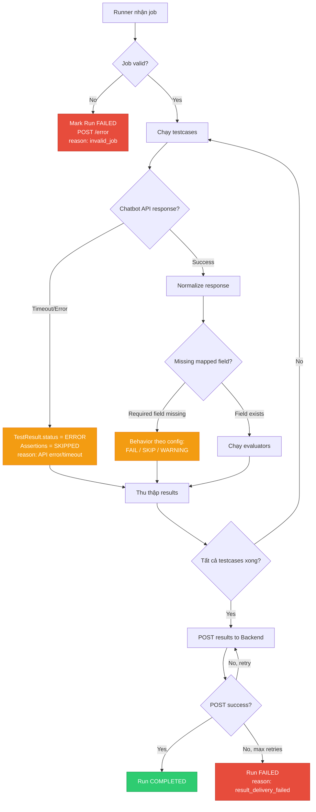
```mermaid
graph TD
    A["Runner nhận job"] --> B{"Job valid?"}
    B -- "No" --> C["Mark Run FAILED<br/>POST /error<br/>reason: invalid_job"]
    B -- "Yes" --> D["Chạy testcases"]
    D --> E{"Chatbot API response?"}
    E -- "Timeout/Error" --> F["TestResult.status = ERROR<br/>Assertions = SKIPPED<br/>reason: API error/timeout"]
    E -- "Success" --> G["Normalize response"]
    G --> H{"Missing mapped field?"}
    H -- "Required field missing" --> I["Behavior theo config:<br/>FAIL / SKIP / WARNING"]
    H -- "Field exists" --> J["Chạy evaluators"]
    J --> K["Thu thập results"]
    F --> K
    I --> K
    K --> L{"Tất cả testcases xong?"}
    L -- "No" --> D
    L -- "Yes" --> M["POST results to Backend"]
    M --> N{"POST success?"}
    N -- "Yes" --> O["Run COMPLETED"]
    N -- "No, retry" --> M
    N -- "No, max retries" --> P["Run FAILED<br/>reason: result_delivery_failed"]

    style C fill:#E74C3C,stroke:#C0392B,color:#FFF
    style F fill:#F39C12,stroke:#E67E22,color:#FFF
    style I fill:#F39C12,stroke:#E67E22,color:#FFF
    style O fill:#2ECC71,stroke:#1A9850,color:#FFF
    style P fill:#E74C3C,stroke:#C0392B,color:#FFF
```

---

## 6. Technology Choices Rationale

### 6.1 Tổng quan lựa chọn

| Thành phần | Công nghệ | Lý do |
|------------|-----------|-------|
| **Frontend** | React + Vite + TypeScript | React ecosystem mature, Vite cho fast dev experience, TypeScript cho type safety trên domain model phức tạp |
| **Backend** | Java Spring Boot | Enterprise-grade, strong typing cho domain model phức tạp, Spring Data JPA cho ORM, Spring Security cho auth, ecosystem lớn |
| **Runner** | Node.js | Promptfoo là Node package, tận dụng native integration. JavaScript phù hợp cho JSON manipulation và HTTP calls |
| **Database** | PostgreSQL | Relational DB phù hợp cho domain model có nhiều quan hệ (Project → Dataset → TestCase → Assertion). JSONB columns cho flexible data |
| **Message Broker** | Redis Streams | Tận dụng Consumer Groups để scale nhiều Runners. Hỗ trợ PEL (Pending Entries List) chống mất data. |
| **Storage** | Local File System | Đơn giản cho MVP. Interface abstraction cho phép migrate sang S3/MinIO sau |
| **Eval Engine** | Promptfoo (adapter) | Proven evaluation framework, hỗ trợ nhiều assertion types + LLM judge. Dùng như adapter, không phải source of truth |

### 6.2 Key Decisions

> [!NOTE]
> Xem thêm ADR (Architecture Decision Records) cho từng quyết định chi tiết.

1. **Domain-first, not promptfoo-first**: Promptfoo là implementation detail. Domain model (TestCase, Assertion, Rubric...) là source of truth. `PromptfooConfigGenerator` chuyển domain → promptfoo config.

2. **Tách Backend (Java) và Runner (Node.js)**: Backend cần strong typing và enterprise features. Runner cần native promptfoo integration (Node.js). Giao tiếp qua Redis queue + REST API.

3. **Redis queue thay vì HTTP sync**: Run có thể mất nhiều phút (100+ testcases × LLM judge). Async processing qua queue là bắt buộc.

4. **Local storage cho MVP**: Giảm complexity ban đầu. Abstract interface cho phép swap sang S3/MinIO trong Phase 3.

5. **Service-to-service auth cho internal API**: Runner không cần biết user context. Dùng pre-shared token hoặc mTLS để authenticate Runner → Backend.

---

## 7. Data Flow Diagrams

### 7.1 Flow 1: QC tạo Project + Target (cURL → Parse → Sample Run → Map Response)

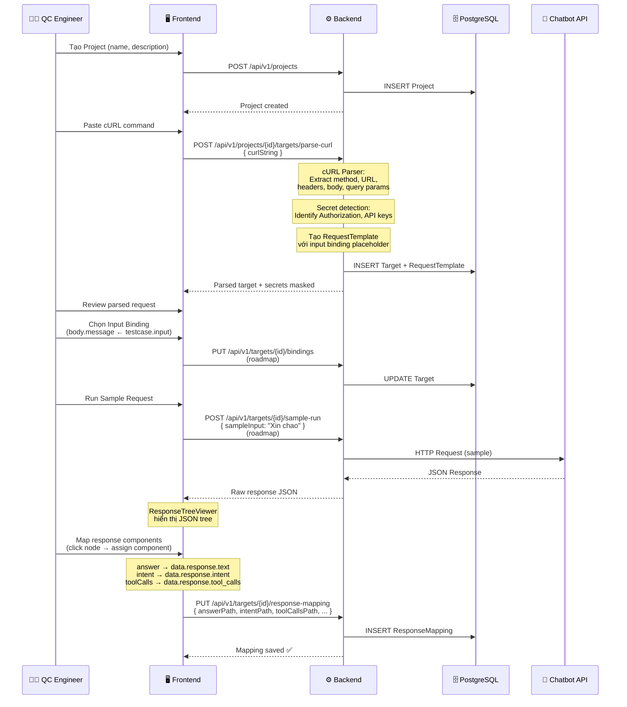
```mermaid
sequenceDiagram
    participant QC as 🧑‍💻 QC Engineer
    participant FE as 🖥️ Frontend
    participant BE as ⚙️ Backend
    participant DB as 🗄️ PostgreSQL
    participant CB as 🤖 Chatbot API

    QC->>FE: Tạo Project (name, description)
    FE->>BE: POST /api/v1/projects
    BE->>DB: INSERT Project
    BE-->>FE: Project created

    QC->>FE: Paste cURL command
    FE->>BE: POST /api/v1/projects/{id}/targets/parse-curl<br/>{ curlString }
    
    Note over BE: cURL Parser:<br/>Extract method, URL,<br/>headers, body, query params
    Note over BE: Secret detection:<br/>Identify Authorization, API keys
    Note over BE: Tạo RequestTemplate<br/>với input binding placeholder
    
    BE->>DB: INSERT Target + RequestTemplate
    BE-->>FE: Parsed target + secrets masked

    QC->>FE: Review parsed request
    QC->>FE: Chọn Input Binding<br/>(body.message ← testcase.input)
    FE->>BE: PUT /api/v1/targets/{id}/bindings<br/>(roadmap)
    BE->>DB: UPDATE Target

    QC->>FE: Run Sample Request
    FE->>BE: POST /api/v1/targets/{id}/sample-run<br/>{ sampleInput: "Xin chao" }<br/>(roadmap)
    BE->>CB: HTTP Request (sample)
    CB-->>BE: JSON Response
    BE-->>FE: Raw response JSON

    Note over FE: ResponseTreeViewer<br/>hiển thị JSON tree

    QC->>FE: Map response components<br/>(click node → assign component)
    Note over FE: answer → data.response.text<br/>intent → data.response.intent<br/>toolCalls → data.response.tool_calls

    FE->>BE: PUT /api/v1/targets/{id}/response-mapping<br/>{ answerPath, intentPath, toolCallsPath, ... }
    BE->>DB: INSERT ResponseMapping
    BE-->>FE: Mapping saved ✅
```

### 7.2 Flow 2: QC Import CSV + Tạo Assertions

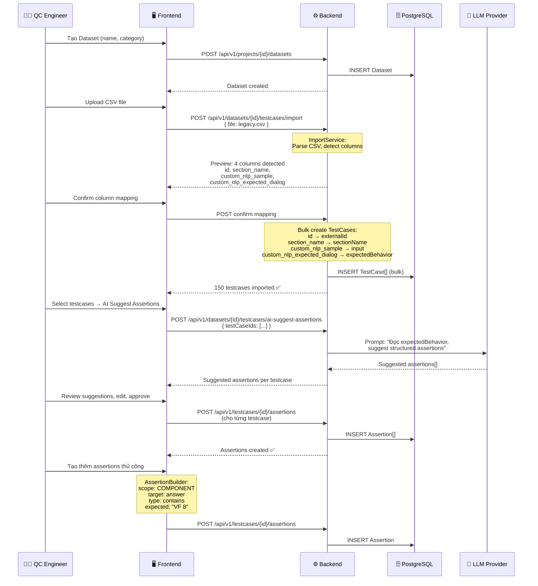
```mermaid
sequenceDiagram
    participant QC as 🧑‍💻 QC Engineer
    participant FE as 🖥️ Frontend
    participant BE as ⚙️ Backend
    participant DB as 🗄️ PostgreSQL
    participant LLM as 🧠 LLM Provider

    QC->>FE: Tạo Dataset (name, category)
    FE->>BE: POST /api/v1/projects/{id}/datasets
    BE->>DB: INSERT Dataset
    BE-->>FE: Dataset created

    QC->>FE: Upload CSV file
    FE->>BE: POST /api/v1/datasets/{id}/testcases/import<br/>{ file: legacy.csv }
    
    Note over BE: ImportService:<br/>Parse CSV, detect columns
    BE-->>FE: Preview: 4 columns detected<br/>id, section_name,<br/>custom_nlp_sample,<br/>custom_nlp_expected_dialog

    QC->>FE: Confirm column mapping
    FE->>BE: POST confirm mapping
    
    Note over BE: Bulk create TestCases:<br/>id → externalId<br/>section_name → sectionName<br/>custom_nlp_sample → input<br/>custom_nlp_expected_dialog → expectedBehavior
    
    BE->>DB: INSERT TestCase[] (bulk)
    BE-->>FE: 150 testcases imported ✅

    QC->>FE: Select testcases → AI Suggest Assertions
    FE->>BE: POST /api/v1/datasets/{id}/testcases/ai-suggest-assertions<br/>{ testCaseIds: [...] }
    
    BE->>LLM: Prompt: "Đọc expectedBehavior,<br/>suggest structured assertions"
    LLM-->>BE: Suggested assertions[]

    BE-->>FE: Suggested assertions per testcase

    QC->>FE: Review suggestions, edit, approve
    FE->>BE: POST /api/v1/testcases/{id}/assertions<br/>(cho từng testcase)
    BE->>DB: INSERT Assertion[]
    BE-->>FE: Assertions created ✅

    QC->>FE: Tạo thêm assertions thủ công
    Note over FE: AssertionBuilder:<br/>scope: COMPONENT<br/>target: answer<br/>type: contains<br/>expected: "VF 8"
    FE->>BE: POST /api/v1/testcases/{id}/assertions
    BE->>DB: INSERT Assertion
```

### 7.3 Flow 3: QC chạy Evaluation (Trigger → Queue → Runner → Results → Report)

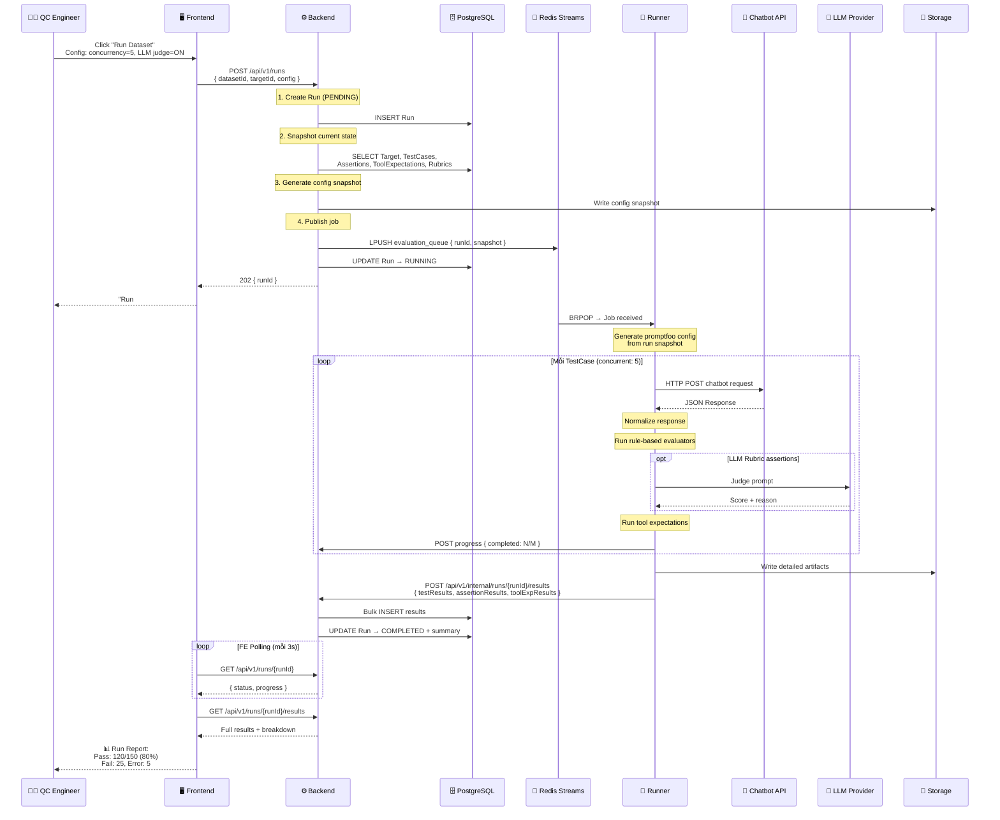
```mermaid
sequenceDiagram
    participant QC as 🧑‍💻 QC Engineer
    participant FE as 🖥️ Frontend
    participant BE as ⚙️ Backend
    participant DB as 🗄️ PostgreSQL
    participant RD as 📮 Redis Streams
    participant RN as 🏃 Runner
    participant CB as 🤖 Chatbot API
    participant LLM as 🧠 LLM Provider
    participant FS as 📁 Storage

    QC->>FE: Click "Run Dataset"<br/>Config: concurrency=5, LLM judge=ON
    FE->>BE: POST /api/v1/runs<br/>{ datasetId, targetId, config }

    Note over BE: 1. Create Run (PENDING)
    BE->>DB: INSERT Run
    
    Note over BE: 2. Snapshot current state
    BE->>DB: SELECT Target, TestCases,<br/>Assertions, ToolExpectations, Rubrics
    
    Note over BE: 3. Generate config snapshot
    BE->>FS: Write config snapshot
    
    Note over BE: 4. Publish job
    BE->>RD: LPUSH evaluation_queue { runId, snapshot }
    BE->>DB: UPDATE Run → RUNNING
    BE-->>FE: 202 { runId }

    FE-->>QC: "Run #42 đang chạy..."

    RD->>RN: BRPOP → Job received

    Note over RN: Generate promptfoo config<br/>from run snapshot

    loop Mỗi TestCase (concurrent: 5)
        RN->>CB: HTTP POST chatbot request
        CB-->>RN: JSON Response
        
        Note over RN: Normalize response
        Note over RN: Run rule-based evaluators
        
        opt LLM Rubric assertions
            RN->>LLM: Judge prompt
            LLM-->>RN: Score + reason
        end
        
        Note over RN: Run tool expectations
        
        RN->>BE: POST progress { completed: N/M }
    end

    RN->>FS: Write detailed artifacts
    RN->>BE: POST /api/v1/internal/runs/{runId}/results<br/>{ testResults, assertionResults, toolExpResults }

    BE->>DB: Bulk INSERT results
    BE->>DB: UPDATE Run → COMPLETED + summary

    loop FE Polling (mỗi 3s)
        FE->>BE: GET /api/v1/runs/{runId}
        BE-->>FE: { status, progress }
    end

    FE->>BE: GET /api/v1/runs/{runId}/results
    BE-->>FE: Full results + breakdown

    FE-->>QC: 📊 Run Report:<br/>Pass: 120/150 (80%)<br/>Fail: 25, Error: 5
```

### 7.4 Flow 4: QC Manual Review Workflow

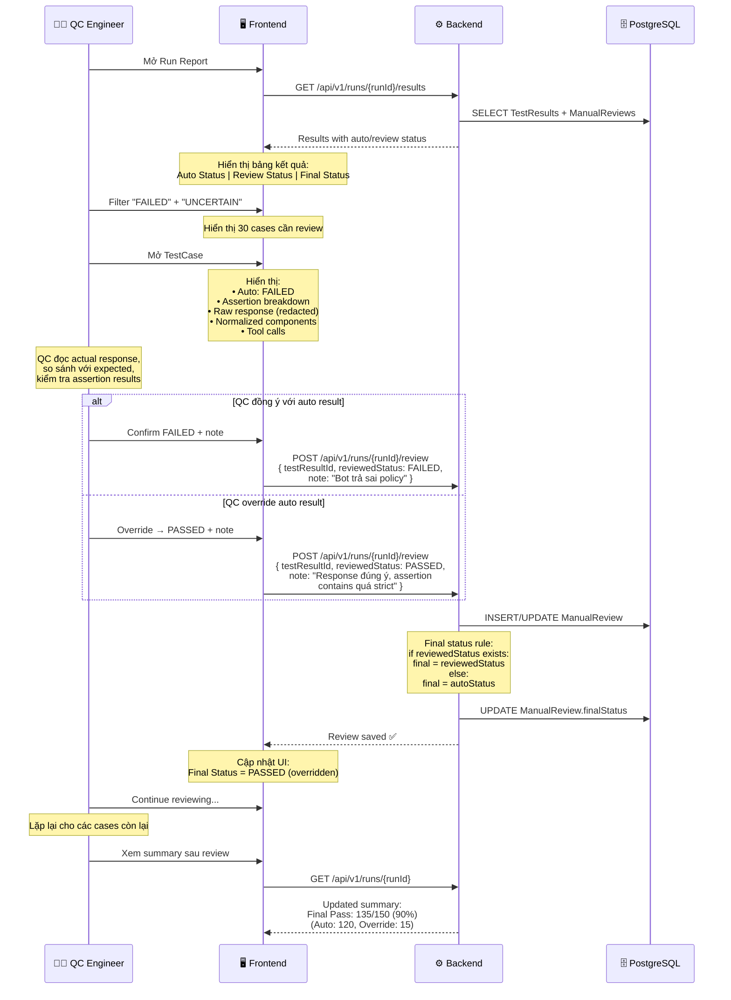
```mermaid
sequenceDiagram
    participant QC as 🧑‍💻 QC Engineer
    participant FE as 🖥️ Frontend
    participant BE as ⚙️ Backend
    participant DB as 🗄️ PostgreSQL

    QC->>FE: Mở Run Report
    FE->>BE: GET /api/v1/runs/{runId}/results
    BE->>DB: SELECT TestResults + ManualReviews
    BE-->>FE: Results with auto/review status

    Note over FE: Hiển thị bảng kết quả:<br/>Auto Status | Review Status | Final Status

    QC->>FE: Filter "FAILED" + "UNCERTAIN"
    Note over FE: Hiển thị 30 cases cần review

    QC->>FE: Mở TestCase #TC015
    Note over FE: Hiển thị:<br/>• Auto: FAILED<br/>• Assertion breakdown<br/>• Raw response (redacted)<br/>• Normalized components<br/>• Tool calls

    Note over QC: QC đọc actual response,<br/>so sánh với expected,<br/>kiểm tra assertion results

    alt QC đồng ý với auto result
        QC->>FE: Confirm FAILED + note
        FE->>BE: POST /api/v1/runs/{runId}/review<br/>{ testResultId, reviewedStatus: FAILED,<br/>  note: "Bot trả sai policy" }
    else QC override auto result
        QC->>FE: Override → PASSED + note
        FE->>BE: POST /api/v1/runs/{runId}/review<br/>{ testResultId, reviewedStatus: PASSED,<br/>  note: "Response đúng ý, assertion<br/>  contains quá strict" }
    end

    BE->>DB: INSERT/UPDATE ManualReview
    Note over BE: Final status rule:<br/>if reviewedStatus exists:<br/>  final = reviewedStatus<br/>else:<br/>  final = autoStatus
    BE->>DB: UPDATE ManualReview.finalStatus
    BE-->>FE: Review saved ✅

    Note over FE: Cập nhật UI:<br/>Final Status = PASSED (overridden)

    QC->>FE: Continue reviewing...
    Note over QC: Lặp lại cho các cases còn lại

    QC->>FE: Xem summary sau review
    FE->>BE: GET /api/v1/runs/{runId}
    BE-->>FE: Updated summary:<br/>Final Pass: 135/150 (90%)<br/>(Auto: 120, Override: 15)
```

---

## 8. Deployment View

### 8.1 MVP: Single Server Deployment

Trong MVP, tất cả containers được deploy trên một server duy nhất. Đây là cách đơn giản nhất để bắt đầu, giảm complexity về networking và operations.

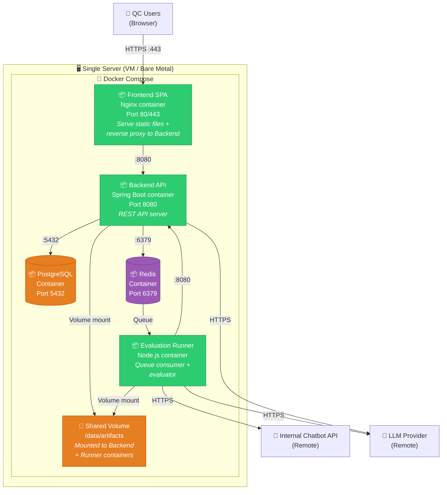
```mermaid
graph TB
    subgraph server ["🖥️ Single Server (VM / Bare Metal)"]
        subgraph docker ["🐳 Docker Compose"]
            FE["📦 Frontend SPA<br/>Nginx container<br/>Port 80/443<br/><i>Serve static files +<br/>reverse proxy to Backend</i>"]
            
            BE["📦 Backend API<br/>Spring Boot container<br/>Port 8080<br/><i>REST API server</i>"]
            
            RUNNER["📦 Evaluation Runner<br/>Node.js container<br/><i>Queue consumer +<br/>evaluator</i>"]
            
            DB[("📦 PostgreSQL<br/>Container<br/>Port 5432")]
            
            REDIS[("📦 Redis<br/>Container<br/>Port 6379")]
            
            STORAGE["📁 Shared Volume<br/>/data/artifacts<br/><i>Mounted to Backend<br/>+ Runner containers</i>"]
        end
    end

    USERS["👤 QC Users<br/>(Browser)"]
    CHATBOT["🤖 Internal Chatbot API<br/>(Remote)"]
    LLM["🧠 LLM Provider<br/>(Remote)"]

    USERS -- "HTTPS :443" --> FE
    FE -- ":8080" --> BE
    BE -- ":5432" --> DB
    BE -- ":6379" --> REDIS
    BE -- "Volume mount" --> STORAGE
    REDIS -- "Queue" --> RUNNER
    RUNNER -- ":8080" --> BE
    RUNNER -- "Volume mount" --> STORAGE
    RUNNER -- "HTTPS" --> CHATBOT
    RUNNER -- "HTTPS" --> LLM
    BE -- "HTTPS" --> LLM

    style FE fill:#2ECC71,stroke:#1A9850,color:#FFF
    style BE fill:#2ECC71,stroke:#1A9850,color:#FFF
    style RUNNER fill:#2ECC71,stroke:#1A9850,color:#FFF
    style DB fill:#E67E22,stroke:#D35400,color:#FFF
    style REDIS fill:#9B59B6,stroke:#7D3C98,color:#FFF
    style STORAGE fill:#E67E22,stroke:#D35400,color:#FFF
```

### 8.2 Docker Compose Configuration (Draft)

```yaml
# docker-compose.yml (simplified)
services:
  frontend:
    image: chatbot-qa-frontend:latest
    ports: ["443:443", "80:80"]
    depends_on: [backend]

  backend:
    image: chatbot-qa-backend:latest
    ports: ["8080:8080"]
    environment:
      - SPRING_DATASOURCE_URL=jdbc:postgresql://postgres:5432/chatbot_qa
      - REDIS_HOST=redis
      - ARTIFACT_PATH=/data/artifacts
      - RUNNER_SERVICE_TOKEN=${RUNNER_SERVICE_TOKEN}
      - LLM_API_KEY=${LLM_API_KEY}
    volumes: [artifacts:/data/artifacts]
    depends_on: [postgres, redis]

  runner:
    image: chatbot-qa-runner:latest
    environment:
      - REDIS_HOST=redis
      - BACKEND_URL=http://backend:8080
      - SERVICE_TOKEN=${RUNNER_SERVICE_TOKEN}
      - ARTIFACT_PATH=/data/artifacts
    volumes: [artifacts:/data/artifacts]
    depends_on: [redis, backend]

  postgres:
    image: postgres:16
    volumes: [pgdata:/var/lib/postgresql/data]
    environment:
      - POSTGRES_DB=chatbot_qa
      - POSTGRES_PASSWORD=${DB_PASSWORD}

  redis:
    image: redis:7-alpine
    volumes: [redisdata:/data]

volumes:
  artifacts:
  pgdata:
  redisdata:
```

### 8.3 Scaling Notes (Phase 3+)

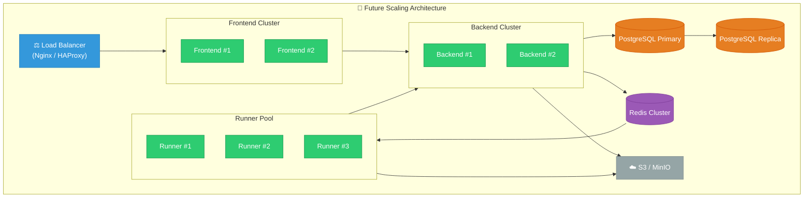
```mermaid
graph TB
    subgraph future ["🔮 Future Scaling Architecture"]
        LB["⚖️ Load Balancer<br/>(Nginx / HAProxy)"]
        
        subgraph fe_cluster ["Frontend Cluster"]
            FE1["Frontend #1"]
            FE2["Frontend #2"]
        end
        
        subgraph be_cluster ["Backend Cluster"]
            BE1["Backend #1"]
            BE2["Backend #2"]
        end
        
        subgraph runner_cluster ["Runner Pool"]
            RN1["Runner #1"]
            RN2["Runner #2"]
            RN3["Runner #3"]
        end
        
        DB_PRIMARY[("PostgreSQL Primary")]
        DB_REPLICA[("PostgreSQL Replica")]
        REDIS_CLUSTER[("Redis Cluster")]
        S3["☁️ S3 / MinIO"]
    end

    LB --> fe_cluster
    fe_cluster --> be_cluster
    be_cluster --> DB_PRIMARY
    DB_PRIMARY --> DB_REPLICA
    be_cluster --> REDIS_CLUSTER
    REDIS_CLUSTER --> runner_cluster
    runner_cluster --> be_cluster
    be_cluster --> S3
    runner_cluster --> S3

    style LB fill:#3498DB,stroke:#2980B9,color:#FFF
    style FE1 fill:#2ECC71,stroke:#1A9850,color:#FFF
    style FE2 fill:#2ECC71,stroke:#1A9850,color:#FFF
    style BE1 fill:#2ECC71,stroke:#1A9850,color:#FFF
    style BE2 fill:#2ECC71,stroke:#1A9850,color:#FFF
    style RN1 fill:#2ECC71,stroke:#1A9850,color:#FFF
    style RN2 fill:#2ECC71,stroke:#1A9850,color:#FFF
    style RN3 fill:#2ECC71,stroke:#1A9850,color:#FFF
    style DB_PRIMARY fill:#E67E22,stroke:#D35400,color:#FFF
    style DB_REPLICA fill:#E67E22,stroke:#D35400,color:#FFF
    style REDIS_CLUSTER fill:#9B59B6,stroke:#7D3C98,color:#FFF
    style S3 fill:#95A5A6,stroke:#7F8C8D,color:#FFF
```

| Scaling Concern | MVP | Phase 3+ |
|-----------------|-----|----------|
| **Frontend** | Single Nginx container | CDN + multiple containers behind LB |
| **Backend** | Single instance | Multiple instances, stateless, shared DB |
| **Runner** | Single instance | Runner pool (N instances) consuming same queue |
| **Database** | Single PostgreSQL | Primary + read replicas, connection pooling |
| **Queue** | Single Redis | Redis Cluster hoặc migrate sang RabbitMQ |
| **Storage** | Local filesystem (shared volume) | S3 / MinIO object storage |
| **Secrets** | Environment variables | HashiCorp Vault / AWS Secrets Manager |

---

## 9. Cross-cutting Concerns

### 9.1 Authentication & Authorization

#### Flow

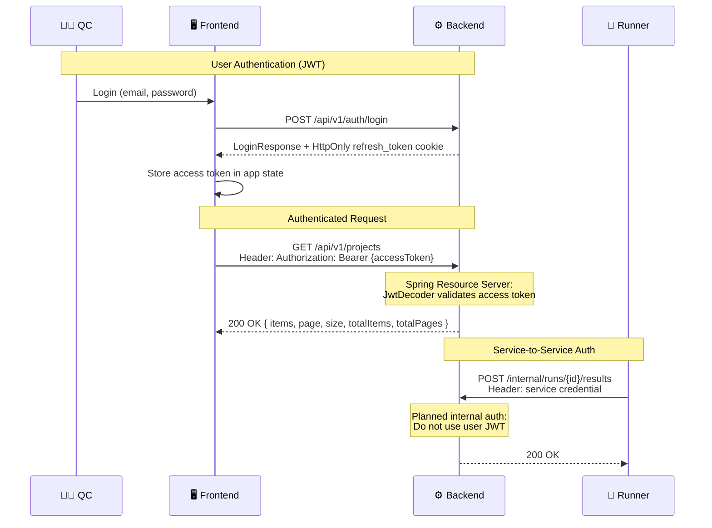
```mermaid
sequenceDiagram
    participant QC as 🧑‍💻 QC
    participant FE as 🖥️ Frontend
    participant BE as ⚙️ Backend
    participant RN as 🏃 Runner

    Note over QC,BE: User Authentication (JWT)
    QC->>FE: Login (email, password)
    FE->>BE: POST /api/v1/auth/login
    BE-->>FE: LoginResponse + HttpOnly refresh_token cookie
    FE->>FE: Store access token in app state

    Note over FE,BE: Authenticated Request
    FE->>BE: GET /api/v1/projects<br/>Header: Authorization: Bearer {accessToken}
    Note over BE: Spring Resource Server:<br/>JwtDecoder validates access token
    BE-->>FE: 200 OK { items, page, size, totalItems, totalPages }

    Note over RN,BE: Service-to-Service Auth
    RN->>BE: POST /internal/runs/{id}/results<br/>Header: service credential
    Note over BE: Planned internal auth:<br/>Do not use user JWT
    BE-->>RN: 200 OK
```

#### Chi tiết

| Aspect | Implementation |
|--------|---------------|
| **User Auth** | Local email/password and Google/GitHub OAuth2 login issue local JWTs. Frontend sends the access token as a Bearer token. |
| **Token Refresh** | Access token is short-lived. Refresh token is a long-lived JWT stored only in the HttpOnly `refresh_token` cookie and rotated by `/api/v1/auth/refresh-token`. |
| **Password Storage** | BCrypt hash |
| **Service Auth** | Planned service credential for Runner -> Backend internal API. Do not forward user JWTs. |
| **Authorization MVP** | Đơn giản: QC Engineer (full access), QC Leader (+ admin features). Advanced RBAC ở Phase 3 |
| **JWT Validation** | Spring Security OAuth2 Resource Server + `JwtDecoder`, token type validation, and `JwtAuthenticationConverter`. No separate handwritten JWT request filter is required. |

### 9.2 Logging

| Aspect | Implementation |
|--------|---------------|
| **Backend** | SLF4J + Logback. Structured JSON logs. Log levels: ERROR, WARN, INFO, DEBUG |
| **Runner** | Winston / Pino. Structured JSON logs. Mỗi job có `runId` trong context |
| **Correlation** | `runId` được dùng làm correlation ID xuyên suốt Backend → Redis → Runner → Backend |
| **Sensitive Data** | Tự động redact: Authorization headers, API keys, passwords. Sử dụng log masking patterns |
| **Request Logging** | Log mọi API request: method, path, status code, duration. Không log request/response body (có thể chứa PII) |
| **Runner Job Logging** | Log chi tiết: job received, testcase started/completed, evaluator results, job completed/failed |

### 9.3 Error Handling

#### Backend Error Response Format

```json
{
  "error": {
    "code": "VALIDATION_ERROR",
    "message": "Invalid assertion type for scope FIELD",
    "details": [
      { "field": "type", "message": "Type 'array_contains' requires scope FIELD with array target" }
    ],
    "traceId": "abc-123-def"
  }
}
```

#### Error Categories

| Category | HTTP Status | Handling |
|----------|-------------|---------|
| **Validation Error** | 400 | Frontend hiển thị field-level errors |
| **Authentication Error** | 401 | Frontend redirect to login |
| **Authorization Error** | 403 | Frontend hiển thị "không có quyền" |
| **Not Found** | 404 | Frontend hiển thị "không tìm thấy" |
| **Business Logic Error** | 409/422 | Frontend hiển thị error message |
| **Internal Error** | 500 | Frontend hiển thị generic error, log full stack trace |
| **Runner Job Error** | N/A | Runner POST error to Backend, mark Run FAILED |
| **Chatbot API Error** | N/A | TestResult.status = ERROR, assertions SKIPPED |
| **LLM Provider Error** | N/A | LLM rubric assertions = ERROR, non-LLM assertions vẫn chạy |

#### Retry Strategy

| Component | Retry Policy |
|-----------|-------------|
| **Frontend → Backend** | Auto retry 1x on 5xx, no retry on 4xx |
| **Runner → Chatbot API** | Configurable retryCount (default: 0–1), exponential backoff |
| **Runner → LLM Provider** | Retry 2x with backoff (LLM APIs có thể flaky) |
| **Runner → Backend (result POST)** | Retry 3x with backoff (critical: không được mất results) |

### 9.4 Secret Management

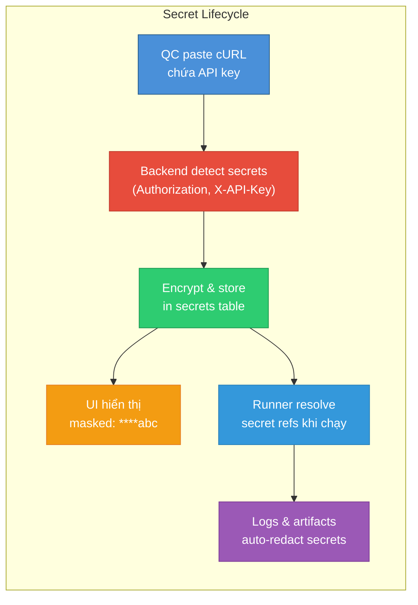
```mermaid
graph LR
    subgraph lifecycle ["Secret Lifecycle"]
        A["QC paste cURL<br/>chứa API key"] --> B["Backend detect secrets<br/>(Authorization, X-API-Key)"]
        B --> C["Encrypt & store<br/>in secrets table"]
        C --> D["UI hiển thị<br/>masked: ****abc"]
        C --> E["Runner resolve<br/>secret refs khi chạy"]
        E --> F["Logs & artifacts<br/>auto-redact secrets"]
    end

    style A fill:#4A90D9,stroke:#2C5F8A,color:#FFF
    style B fill:#E74C3C,stroke:#C0392B,color:#FFF
    style C fill:#2ECC71,stroke:#1A9850,color:#FFF
    style D fill:#F39C12,stroke:#E67E22,color:#FFF
    style E fill:#3498DB,stroke:#2980B9,color:#FFF
    style F fill:#9B59B6,stroke:#7D3C98,color:#FFF
```

| Aspect | Implementation |
|--------|---------------|
| **Storage** | Encrypted at rest trong `secrets` table (AES-256). MVP dùng application-level encryption |
| **Reference** | `{{secret:secret_name}}` — placeholder trong templates, resolve tại runtime |
| **UI Masking** | Luôn hiển thị masked value: `****last4chars` |
| **Log Redaction** | Pattern-based redaction: detect Authorization, Bearer, API key patterns → replace with `[REDACTED]` |
| **Artifact Redaction** | Promptfoo output và reports phải qua redaction filter trước khi lưu |
| **SSRF Protection** | Domain allowlist cho Runner HTTP client. Block localhost, metadata URLs, private ranges trừ khi explicitly configured |
| **Phase 3+** | Migrate sang HashiCorp Vault hoặc cloud-native secret manager |

---

> [!TIP]
> Tài liệu này nên được cập nhật mỗi khi có thay đổi kiến trúc lớn. Tham khảo [PRD v1.0](../product/PRD.md) cho business context đầy đủ.
