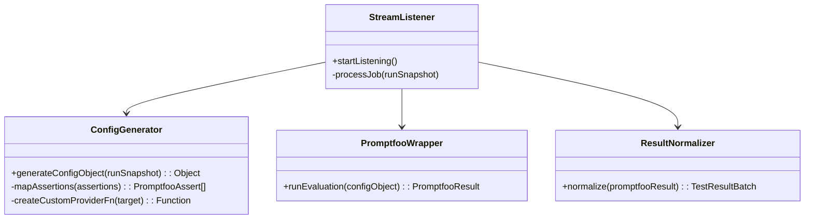

# Low-Level Design (LLD) & Testing Strategy: Full Stack

> **Tham chiếu:** PRD v1.0, C4 Architecture v1.0, ADR_001, ADR_002, ADR_003

Tài liệu này đi sâu vào thiết kế chi tiết cấp độ code (Low-Level Design) cho toàn bộ nền tảng, bao gồm chiến lược tổ chức UI Frontend, tối ưu hóa thuật toán Backend, kiến trúc xử lý của Runner và các quy chuẩn Testing.

---

## 1. Frontend UI & State Architecture (`apps/client/`)

Với tính chất ứng dụng data-heavy (xử lý cây JSON lớn, bảng dữ liệu hàng trăm dòng), việc thiết kế Frontend LLD đóng vai trò quyết định để tránh tình trạng giật, lag (React re-render hell).

### 1.1. LLD Component: `TargetSetup` & `JsonTreeViewer`

**Vấn đề:** Màn hình cấu hình `ResponseMapping` yêu cầu load một `RawResponse` JSON khổng lồ từ chatbot. QC click vào từng nhánh JSON để map vào các cột như `answer`, `intent`. Nếu làm sai, mỗi lần click sẽ re-render lại toàn bộ cây JSON.

**Thiết kế (State & Component):**
- **Tránh lưu JSON String vào UI State:** Cây JSON gốc chỉ render 1 lần duy nhất bằng đệ quy (Recursive Components).
- **Zustand Store (`useTargetStore`):** Chỉ lưu giữ object mapping (VD: `{"answer": "$.data.reply"}`).
- Khi user click vào một node JSON trên giao diện `JsonTreeViewer`, component node đó dispatch action `setMapping(key, path)` thẳng vào store.
- **Memoization:** Dùng `React.memo()` bọc component đệ quy. Cây JSON sẽ hoàn toàn bất động, chỉ có icon checkmark thay đổi dựa trên derived state từ store. Điều này đảm bảo tốc độ 60fps ngay cả với JSON 10,000 dòng.

### 1.2. LLD State: `RunReport` Viewer

**Vấn đề:** Khi mở Report của 1 Run chứa 500 testcases, QC muốn bấm nút filter (Lọc ra các case FAILED). Gọi API nhiều lần sẽ gây quá tải cho backend và làm lag UI.

**Thiết kế:**
- Load toàn bộ `RunResult` (JSON) về RAM 1 lần duy nhất khi mở trang.
- Đẩy data vào `useRunReportStore` (Zustand).
- Các chức năng Filter (Lọc FAILED, UNCERTAIN) sử dụng **Derived State** (Zustand selectors hoặc `useMemo` của React). Frontend tự filter trên RAM (điều này khả thi vì data 500 testcases chỉ tốn vài MB RAM), mang lại trải nghiệm tức thì (Zero-latency filtering).

---

## 2. Backend Services LLD (`apps/api/v1/`)

Backend có 2 luồng thuật toán rất nguy hiểm nếu code không cẩn thận: Import dữ liệu và Tổng hợp Run.

### 2.1. Thuật toán `ImportService` (Chống OOM & Nghẽn DB)

**Vấn đề:** Import file CSV chứa hàng vạn testcases. Nếu load tất cả vào RAM hoặc query kiểm tra trùng lặp từng dòng (`SELECT * WHERE external_id = X`), DB sẽ bị quá tải (N+1 query problem).

**Logic xử lý (Batch Processing & Streaming):**
1. Dùng thư viện (như `Apache Commons CSV`) đọc file theo luồng (Stream), không lưu toàn bộ file vào list.
2. Gom các dòng lại thành các chunks (VD: `List<TestCaseDraft> chunk = new ArrayList<>(500)`).
3. **Batch Check Duplicate:** Trích xuất 500 `external_id` từ chunk, thực hiện đúng 1 câu SQL: 
   `SELECT external_id FROM testcases WHERE dataset_id = :id AND external_id IN (:ids)`
4. Lọc bỏ các dòng trùng, sau đó dùng `repository.saveAll()` để Hibernate kích hoạt **Batch Insert** (chèn 500 dòng/lần).
5. Xóa RAM (`chunk.clear()`) và đọc tiếp.

### 2.2. Thuật toán `RunService` (Tổng hợp RunSnapshot)

**Vấn đề:** Khi QC bấm nút "Run", hệ thống phải đóng gói 1 `Target`, 200 `TestCases`, 1000 `Assertions`, 300 `ToolExpectations`, và 5 `Rubrics` thành 1 file JSON duy nhất đẩy vào Redis. Lấy dữ liệu ngây thơ sẽ sinh ra hàng ngàn câu lệnh SQL.

**Logic xử lý (Batch Fetching & Java Mapping):**
Thay vì vòng lặp, ta lấy dữ liệu bằng chính xác 5 câu SQL:
1. Fetch `Target` (1 query).
2. Fetch List `TestCase` theo `datasetId` (1 query). → Lấy ra `List<String> testCaseIds`.
3. Fetch toàn bộ `Assertion`: `SELECT a FROM Assertion a WHERE a.testCase.id IN (:testCaseIds)` (1 query).
4. Fetch toàn bộ `ToolExpectation` dùng `IN` clause (1 query).
5. Fetch `Rubric` (1 query).

Sau đó, dùng `Java 8 Stream (Collectors.groupingBy)` để gắn `Assertion` và `ToolExpectation` vào đúng `TestCase` tương ứng trên RAM. Tổng thời gian xử lý chưa tới 50ms.

### 2.3. Backend Implementation Standards
Để đảm bảo code clean và đúng chuẩn công nghiệp, Backend sẽ áp dụng bộ công cụ tiêu chuẩn sau:
- **Lombok (`@Builder`, `@Data`)**: Áp dụng cho toàn bộ Entity và DTO để loại bỏ 100% mã boilerplate (getter, setter, constructor). Tránh việc dev tự code Builder pattern bằng tay cho Data classes.
- **MapStruct**: Xử lý toàn bộ logic mapping từ Entity sang DTO và ngược lại. Bản chất đây là một Adapter sinh code tự động lúc compile, tốc độ thực thi tương đương code tay và an toàn hơn modelmapper.
- **Spring Boot 4.1.0 SSRF Mitigation**: Tận dụng tính năng `InetAddressFilter` mới nhất của Spring Boot 4.1.0 để chặn các request độc hại gọi vào dải IP nội bộ (Ví dụ: chặn `http://127.0.0.1` hay `10.x.x.x`). Đây là chốt chặn bảo mật cực kỳ quan trọng khi platform cho phép user nhập Target URL tùy ý.

---

## 3. Evaluation Runner Engine LLD (`apps/runner/`)

Runner chạy độc lập, đóng vai trò là một **Adapter** để gọi thư viện `promptfoo`. Chúng ta **KHÔNG** tự code lại vòng lặp chấm điểm (Evaluators), mà nhường toàn bộ việc execution cho `promptfoo`.

### 3.1. Luồng xử lý: RunSnapshot → In-Memory Config → Results

**Vấn đề:** Spring Boot gửi xuống một `RunSnapshot` (JSON) qua Redis Stream. Làm sao để `promptfoo` hiểu được cục JSON này mà không cần sinh file rác?

**Logic xử lý (Adapter Pattern - In-Memory API):**
1. **`StreamListener`:** Nhận `RunSnapshot` từ Redis.
2. **`ConfigGenerator`:** Convert `RunSnapshot` thành một JavaScript Object (In-Memory Config) đưa thẳng cho Node API của promptfoo. Tuyệt đối không sinh file YAML tạm thời (Disk I/O Bottleneck).
   - **Đặc biệt (Custom Provider):** Dựa theo tài liệu `promptfoo_yaml_nodejs_llm_spec.md` (Approach B), ta **không** dùng HTTP Provider mặc định hay ghi file `provider.js`. Ta nhét thẳng một hàm `async (prompt, context) => {...}` vào mảng `providers` của config object. Hàm này tự động gọi Chatbot API, parse biến, chọc JSONPath để bóc tách field và trả về { output } sạch sẽ.
   - Map `TestCase` -> `tests[].vars` (Inject biến input vào).
   - Map `Assertion` -> `tests[].assert` (Convert type: `CONTAINS` -> `icontains`, `RUBRIC` -> `llm-rubric`).
3. **`PromptfooWrapper`:** Chạy `await promptfoo.evaluate(configObject)`. Toàn bộ chạy trên RAM.
4. **`ResultNormalizer`:** Parse kết quả của promptfoo thành chuẩn `TestResult` và POST về Backend.

### 3.2. Caching & State Management (Throttling API)
Runner sử dụng một local in-memory buffer: `resultBuffer = []`. Cứ mỗi khi `PromptfooWrapper` xử lý xong một batch testcase, kết quả sẽ được đưa vào buffer. Cứ mỗi 2 giây, HOẶC khi buffer đạt 50 items, Runner sẽ xả (flush) buffer bằng 1 request `POST` gửi về Backend, giúp Backend DB không bị quá tải bởi hàng ngàn update nhỏ lẻ.

---

## 4. Testing Strategy (Chiến lược Test thực dụng)

Thay vì áp dụng DevSecOps khổng lồ với các tool bên thứ ba, chúng ta áp dụng testing nội bộ bằng công cụ chuẩn để đạt độ tin cậy tối đa với chi phí thấp nhất.

### 4.1. Backend Testing (JUnit 5 + MockMvc + Mockito)

1. **Security / API Contract Test:**
   - Sử dụng `MockMvc` viết bài test `SecurityFilterTest`.
   - Bắn Request `GET /api/v1/projects` không kèm Bearer Token -> Expect `HTTP 401 Unauthorized`.
   - Bắn Request kèm access JWT hợp lệ -> Expect request protected API đi qua Spring Resource Server `JwtDecoder`.
   - Bắn Request kèm refresh JWT vào protected API -> Expect `HTTP 401 Unauthorized` vì refresh token không được dùng để authenticate API request.
   - Khi authorization rule theo owner được triển khai, bắn token của User A vào project của User B -> Expect `HTTP 403 Forbidden`.
   
2. **Service Layer Test (Business Logic):**
   - Viết test cho `ImportService` và `RunService` (2 logic phức tạp ở trên).
   - Dùng `Mockito` giả lập Database trả về 1 danh sách Testcase. Test xem thuật toán gom nhóm (`groupingBy`) hoặc check trùng lặp có chạy đúng không. Hoàn toàn không nối tới DB thực.

### 4.2. Runner Testing (Jest + Mock)

Vì Runner là Adapter giao tiếp với `promptfoo`, mục tiêu test không phải là test xem `promptfoo` chấm điểm đúng hay sai (việc đó thư viện promptfoo đã lo), mà là test **sự chuyển đổi (Adapter Logic)**.

1. **Unit Test: `ConfigGenerator` (Bắt buộc 100% Coverage)**
   - Cấp một `RunSnapshot` JSON giả định.
   - Assert (Kỳ vọng) hàm sinh ra đúng **Object cấu hình** của promptfoo (không phải YAML string).
   - Ví dụ: Test xem hàm `createCustomProviderFn()` có sinh ra đúng hàm JS gọi fetch API với mapping biến đúng không. Test xem `Assertion` có map thành `icontains` không.

2. **Integration Test cho luồng `PromptfooWrapper`:**
   - Dùng Jest mock hàm `promptfoo.evaluate()` để trả về một Object kết quả giả định.
   - Test class `ResultNormalizer` xem nó có bóc tách đúng JSON của promptfoo để trả về `TestResult` của platform mình không.

3. **Backend AI Testing (Sinh Testcase/Gợi ý Assertion):**
   - Không test LLM API bằng HTTP thật.
   - Dùng thư viện `WireMock` (trên Java) chặn endpoint của OpenAI.
   - Setup mock trả về JSON rác (không chuẩn cấu trúc). Test xem `AIGeneratorService` có ném ra exception hoặc retry đúng cách hay không. (Test Edge Cases).
