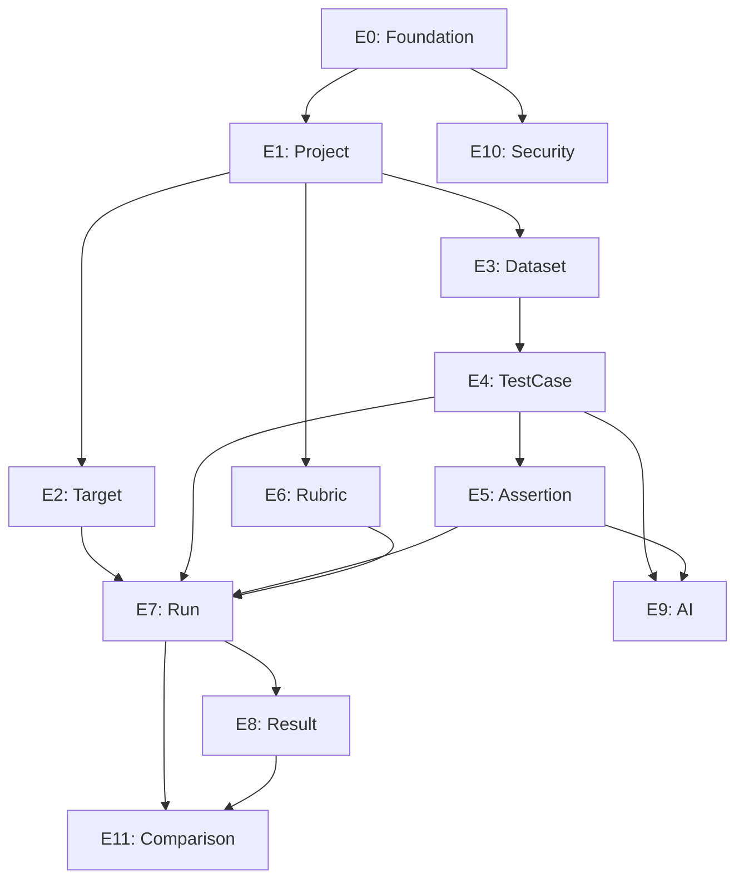

# Backend Task Breakdown (`apps/api`)

> References: `apps/api/CONTEXT.md`, `docs/product/PRD.md`, `docs/architecture/LLD_FullStack.md`, `docs/architecture/Database_Design.md`, `docs/architecture/API_Design.md`.
>
> Source-of-truth rule: current code and `apps/api/CONTEXT.md` win when older product docs disagree.

## Current Backend Baseline

These choices are already implemented. Do not rebuild them unless the task explicitly says to migrate.

| Area | Current state |
|---|---|
| Framework | Spring Boot 4.0.7, Java 21, Maven |
| Persistence | PostgreSQL + Flyway. Current migrations: `V1__init_schema.sql`, `V2__project_schema.sql`, `V3__target_schema.sql`, `V4__dataset_schema.sql`, `V5__test_case_schema.sql`, `V6__test_case_import_preview_schema.sql`, `V7__rubric_schema.sql`, `V8__assertion_schema.sql`, `V9__tool_expectation_schema.sql`, `V10__run_schema.sql`, `V11__result_schema.sql`, `V12__manual_review_schema.sql`, `V13__experiment_schema.sql` |
| Identity model | Internal `BIGINT id`; public APIs expose UUID `publicId` |
| Auth | Local email/password auth, Google/GitHub OAuth2 login, custom JWT issuing |
| JWT validation | Spring Security OAuth2 Resource Server with `JwtDecoder`; no separate handwritten JWT request filter is needed |
| Refresh flow | HttpOnly `refresh_token` cookie, rotated by `POST /api/v1/auth/refresh-token` |
| Implemented APIs | Auth, OAuth2, `GET /api/v1/users/me`, Project CRUD/archive, Target CRUD/parse-curl, ResponseMapping get/save, Dataset CRUD/archive, TestCase CRUD/list/filter/import, Assertion CRUD/list, ToolExpectation CRUD/list, Rubric CRUD/archive/list, Run trigger/status/history, Result ingestion/report/listing/comparison, ManualReview batch submission, Experiment create/list/detail/start/comparison |
| Not yet implemented | Dashboard aggregate endpoint, prompt/config versioning and promotion contracts |

## Status Legend

| Status | Meaning |
|---|---|
| `TODO` | Not implemented |
| `IN_PROGRESS` | Being implemented |
| `DONE` | Implemented and reviewed |
| `WARNING` | Accepted with known follow-up |
| `BLOCKED` | Do not continue until fixed |

## Verification Commands

Run after each code-changing backend subtask.

```bash
rtk bash mvnw compile
rtk bash mvnw test
```

Use focused tests when possible. Avoid rerunning expensive full suites when code has not changed.

## Scope Sizing

| Size | Expected change |
|---|---|
| `S` | 1-2 files, entity/migration or simple service |
| `M` | 3-5 files, one complete CRUD slice |
| `L` | 5-8 files, complex flow such as import or run snapshot assembly |

## Backend Roadmap

```text
apps/api/
|-- E0: Foundation & Infrastructure
|   |-- E0.1: Project scaffold + dependencies
|   |-- E0.2: Global config
|   |-- E0.3: PostgreSQL + Flyway
|   `-- E0.4: Redis Streams
|
|-- E1: Project Module
|   |-- E1.1: Entity + DTO + Mapper
|   |-- E1.2: Repository + Service
|   `-- E1.3: Controller + Tests
|
|-- E2: Target & ResponseMapping Module
|   |-- E2.1: Entity + DTO + Mapper
|   |-- E2.2: cURL Parser Service
|   |-- E2.3: Services
|   `-- E2.4: Controllers + Tests
|
|-- E3: Dataset Module
|-- E4: TestCase Module
|-- E5: Assertion & ToolExpectation Module
|-- E6: Rubric Module
|-- E7: Run Module
|-- E8: Result & ManualReview Module
|-- E9: AI Integration Module
|-- E10: Security Hardening
`-- E11: Run Comparison & Experiment Module
```

## Epic Details

- [E0: Foundation & Infrastructure](./backend_epics/E0_Foundation.md)
- [E1: Project Module](./backend_epics/E1_Project.md)
- [E2: Target & ResponseMapping Module](./backend_epics/E2_Target_ResponseMapping.md)
- [E3: Dataset Module](./backend_epics/E3_Dataset.md)
- [E4: TestCase Module](./backend_epics/E4_TestCase.md)
- [E5: Assertion & ToolExpectation Module](./backend_epics/E5_Assertion_ToolExpectation.md)
- [E6: Rubric Module](./backend_epics/E6_Rubric.md)
- [E7: Run Module](./backend_epics/E7_Run.md)
- [E8: Result & ManualReview Module](./backend_epics/E8_Result_ManualReview.md)
- [E9: AI Integration Module](./backend_epics/E9_AI_Integration.md)
- [E10: Security Hardening](./backend_epics/E10_Security.md)
- [E11: Run Comparison & Experiment Module](./backend_epics/E11_Experiment_Comparison.md)

## Dependency Graph



## Product Prototype Note

`docs/product/EvalDeskQAPlatform.html` is an AI-generated UI prototype and should be treated as product aspiration, not a literal backend contract. It implies these backend capabilities:

- Dashboard: aggregate recent runs, pass rate, and dataset counts.
- Config: target API setup, LLM judge settings, verification rules, dataset column metadata.
- Dataset: import/preview/manage test cases and columns.
- Test Run: trigger asynchronous evaluation and stream status.
- Results: field-level pass/fail breakdown, comparison, and manual review.

Comparison/A-B clarification:

- Current backend supports independent runs and reports.
- Current backend exposes `GET /api/v1/runs/compare?baseRunId=&candidateRunId=` for completed compatible runs.
- Current backend exposes draft A/B experiment entities and APIs that start one run per variant.
- Prompt/config versioning and winner promotion are still not implemented; variants currently reference targets and
  runtime options.

## Resolved Decisions

| Decision | Current answer |
|---|---|
| Migration tool | Flyway is selected and configured. |
| JWT provider | Custom local JWT issuing is implemented with Spring Security JWT validation. |
| API auth base path | Current implemented path is `/api/v1/auth`; older unversioned auth paths and session-style paths are legacy only. |

## Remaining Risks

| # | Risk | Impact | Mitigation |
|---|---|---|---|
| 1 | AI LLM provider may change | Medium | Keep AI generation behind an interface; current dependency includes Google GenAI via Spring AI. |
| 2 | Large CSV import can timeout HTTP | Medium | Add streaming parser and chunked persistence; move to async import if needed. |
| 3 | Large RunSnapshot can exceed Redis payload limits | High | Chunk snapshots or persist snapshot in DB/object storage and send only a reference through Redis. |
| 4 | User-supplied target URLs can hit private networks | High | Implement SSRF validation before saving or sampling targets. |
