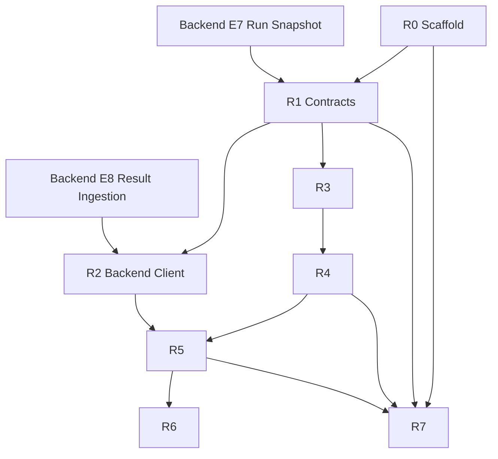

# Runner Task Breakdown (`apps/runner`)

> References: `docs/architecture/C4_Architecture.md`, `docs/architecture/LLD_FullStack.md`,
> `docs/integrations/promptfoo_yaml_nodejs_llm_spec.md`, `docs/decisions/ADR_001_Redis_Streams.md`,
> `docs/decisions/ADR_002_Promptfoo_Evaluation_Engine.md`, and current backend `apps/api/CONTEXT.md`.
>
> Source-of-truth rule: backend `RunSnapshotDto` and internal result ingestion API win over older architecture examples.

## Current Runner Baseline

No `apps/runner` implementation exists yet. Backend currently publishes run snapshots to Redis and accepts result
callbacks at `POST /api/v1/internal/runs/{runId}/results` with `X-Runner-Token`.

| Area | Current state |
|---|---|
| Runtime | TODO: Node.js + TypeScript service under `apps/runner` |
| Package manager | TODO: align with repo frontend tooling unless a runner-specific reason appears |
| Queue | Redis Streams consumer group, matching backend publisher |
| Evaluation engine | promptfoo Node API first; CLI fallback only if API integration blocks |
| Result callback | Backend endpoint exists for final/batched results |
| Progress/error callback | Backend endpoints are referenced by architecture docs but not implemented yet |
| Security | Runner must use service token, SSRF guard, secret resolution, and redaction |

## Status Legend

| Status | Meaning |
|---|---|
| `TODO` | Not implemented |
| `IN_PROGRESS` | Being implemented |
| `DONE` | Implemented and reviewed |
| `WARNING` | Accepted with known follow-up |
| `BLOCKED` | Do not continue until fixed |

## Verification Commands

Run after each code-changing runner subtask once `apps/runner` exists.

```bash
rtk pnpm --filter runner typecheck
rtk pnpm --filter runner test
rtk pnpm --filter runner lint
```

If the repo chooses a different runner package name, update these commands in the first runner commit.

## Scope Sizing

| Size | Expected change |
|---|---|
| `S` | 1-2 focused files or a small mapper |
| `M` | One complete module with unit tests |
| `L` | Queue loop, promptfoo adapter, or end-to-end flow |

## Runner Roadmap

```text
apps/runner/
|-- R0: Scaffold & Tooling
|-- R1: Contracts & Validation
|-- R2: Queue Consumer & Backend Client
|-- R3: Target Execution & Normalization
|-- R4: Promptfoo Adapter
|-- R5: Result Reporting & Artifacts
|-- R6: Reliability, Security & Operations
`-- R7: Test Strategy & Smoke Flows
```

## Epic Details

- [R0: Scaffold & Tooling](./runner_epics/R0_Scaffold_Tooling.md)
- [R1: Contracts & Validation](./runner_epics/R1_Contracts_Validation.md)
- [R2: Queue Consumer & Backend Client](./runner_epics/R2_Queue_Backend_Client.md)
- [R3: Target Execution & Normalization](./runner_epics/R3_Target_Normalization.md)
- [R4: Promptfoo Adapter](./runner_epics/R4_Promptfoo_Adapter.md)
- [R5: Result Reporting & Artifacts](./runner_epics/R5_Result_Reporting_Artifacts.md)
- [R6: Reliability, Security & Operations](./runner_epics/R6_Reliability_Security_Ops.md)
- [R7: Test Strategy & Smoke Flows](./runner_epics/R7_Test_Strategy.md)

## Dependency Graph



## Backend Integration Gaps

| Gap | Impact | Runner handling until resolved |
|---|---|---|
| `POST /api/v1/internal/runs/{runId}/progress` not implemented | Cannot persist live progress in backend | Keep local logs/metrics; make progress client optional |
| `POST /api/v1/internal/runs/{runId}/error` not implemented | Fatal runner failures cannot mark run failed through dedicated endpoint | Send final result batch where possible; log fatal errors clearly |
| Large snapshot payload risk remains | Redis message may become too large for very large datasets | Keep contracts ready for future snapshot reference mode |
| Target URL SSRF validation not fully enforced end-to-end | Runner could call unsafe URLs if backend validation misses one | Runner must implement its own SSRF guard before HTTP execution |

## Acceptance Target

Runner MVP is complete when a run snapshot from Redis can be consumed, executed against the configured target, evaluated
through promptfoo/domain mappers, and reported back to backend as batched `TestResult`, `AssertionResult`, and
`ToolExpectationResult` payloads with service-token auth.
